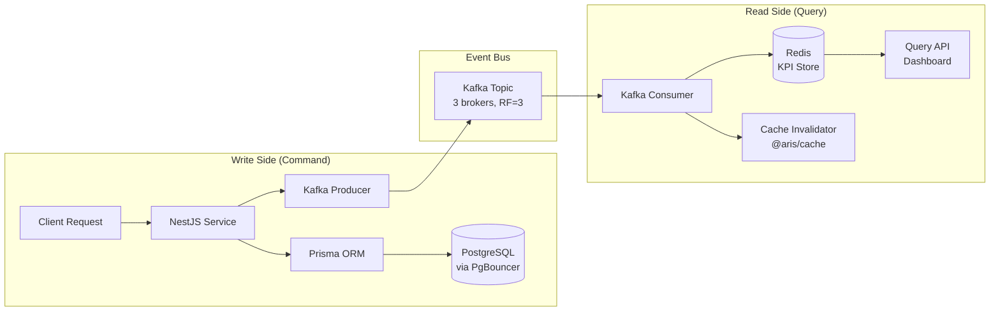

# ARIS 4.0 — Architecture Overview

> Quick reference for architects, developers, and decision-makers.
> For detailed documentation, see [docs/architecture/](./docs/architecture/).

---

## High-Level Architecture

```mermaid
graph TB
    subgraph "Clients"
        WEB["Next.js 14 Web App<br/>(51+ pages, i18n 4 languages)"]
        ADMIN["Admin Panel<br/>(15 pages)"]
        MOBILE["Kotlin Android<br/>(Offline-First)"]
        LANDING["Public Landing Pages<br/>(Continental / REC / Country)"]
    end

    subgraph "API Gateway"
        TRAEFIK["Traefik v3<br/>:4000 HTTP / :4443 HTTPS<br/>Rate limiting, routing"]
    end

    subgraph "Auth Layer"
        AUTH["@aris/auth-middleware<br/>JWT RS256 + RBAC + TenantGuard"]
    end

    subgraph "Platform Services (CC-1)"
        TENANT["Tenant :3001"]
        CRED["Credential :3002"]
        MSG["Message :3006"]
        DRIVE["Drive :3007"]
        RT["Realtime :3008"]
    end

    subgraph "Data Hub (CC-2)"
        MD["Master Data :3003"]
        DQ["Data Quality :3004"]
        DC["Data Contract :3005"]
        INTEROP["Interop Hub :3032"]
    end

    subgraph "Collecte & Workflow (CC-3)"
        FB["Form Builder :3010"]
        COL["Collecte :3011"]
        WF["Workflow :3012"]
    end

    subgraph "Domain Services (CC-4)"
        AH["Animal Health :3020"]
        LP["Livestock Prod :3021"]
        FISH["Fisheries :3022"]
        WILD["Wildlife :3023"]
        APIC["Apiculture :3024"]
        TRADE["Trade & SPS :3025"]
        GOV["Governance :3026"]
        CLIM["Climate & Env :3027"]
    end

    subgraph "Data & Integration (CC-4)"
        ANALYTICS["Analytics :3030"]
        GEO["Geo Services :3031"]
        KH["Knowledge Hub :3033"]
    end

    subgraph "Infrastructure"
        PG["PostgreSQL 16 + PostGIS 3.4"]
        PGBOUNCER["PgBouncer :6432<br/>Transaction Pooling"]
        KAFKA["Apache Kafka<br/>3 Brokers (KRaft)"]
        REDIS["Redis 7<br/>Cache + Locks"]
        ES["OpenSearch 2"]
        MINIO["MinIO (S3)"]
        PROM["Prometheus + Grafana"]
    end

    WEB & ADMIN & MOBILE & LANDING --> TRAEFIK
    TRAEFIK --> AUTH
    AUTH --> TENANT & CRED & MSG & DRIVE & RT
    AUTH --> MD & DQ & DC & INTEROP
    AUTH --> FB & COL & WF
    AUTH --> AH & LP & FISH & WILD & APIC & TRADE & GOV & CLIM
    AUTH --> ANALYTICS & GEO & KH

    TENANT & CRED & MD & DQ & COL & WF & AH & LP --> KAFKA
    KAFKA --> ANALYTICS & INTEROP & RT & WF

    PGBOUNCER --> PG
    TENANT & CRED & MD & DQ & COL & WF & AH & LP & FISH --> PGBOUNCER

    ANALYTICS & CRED --> REDIS
    KH & MD --> ES
    DRIVE --> MINIO
    PROM -.->|scrape| TENANT & CRED & MD
```



---

## CQRS / Event Sourcing with Kafka

ARIS uses a CQRS (Command Query Responsibility Segregation) pattern with Kafka as the event backbone.



**Data flow:**
1. **Command**: Client sends mutation via REST API
2. **Persist**: Service writes to PostgreSQL through PgBouncer (transaction pooling)
3. **Publish**: Service emits domain event to Kafka topic
4. **Consume**: Analytics/other services consume events asynchronously
5. **Materialize**: KPIs are computed and stored in Redis read models
6. **Invalidate**: `@aris/cache` CacheInvalidationService clears stale entries

---

## Multi-Tenant Hierarchy

```
AU-IBAR (CONTINENTAL)            ← Sees all data
  ├── ECOWAS (REC)               ← Sees 15 Member States
  │   ├── Nigeria (MEMBER_STATE) ← Sees own data only
  │   ├── Senegal (MEMBER_STATE)
  │   └── ... (15 states)
  ├── IGAD (REC)                 ← Sees 8 Member States
  │   ├── Kenya (MEMBER_STATE)
  │   ├── Ethiopia (MEMBER_STATE)
  │   └── ... (8 states)
  ├── EAC (REC)
  ├── SADC (REC)
  ├── ECCAS (REC)
  ├── UMA (REC)
  ├── CEN-SAD (REC)
  └── COMESA (REC)
```

- Every query includes `WHERE tenant_id = ?` (no exceptions)
- Parent tenants can read children's data
- `tenantId` extracted from JWT by `TenantGuard`
- Inter-service calls forward `x-tenant-id` header

---

## Security

| Layer | Mechanism |
|-------|-----------|
| **Authentication** | JWT RS256 (RSA 2048-bit keys, loaded from PEM files) |
| **Authorization** | 8 RBAC roles, per-endpoint guards |
| **MFA** | TOTP-based multi-factor authentication |
| **Tenant isolation** | `tenantId` in every DB query and Kafka message |
| **Rate limiting** | Per-IP and per-user via Redis (`@aris/cache`) |
| **Connection pooling** | PgBouncer (MD5 auth, transaction mode) |
| **Kafka ACLs** | Per-service topic access control |
| **Audit trail** | Every mutation logged with actor, timestamp, classification |
| **Data classification** | PUBLIC / PARTNER / RESTRICTED / CONFIDENTIAL |

---

## Infrastructure — PgBouncer + Redis Cache

### PgBouncer (Connection Pooling)

With 22 microservices each opening Prisma connection pools, PgBouncer prevents connection exhaustion.

- **Mode**: Transaction pooling (connections returned to pool after each transaction)
- **Max clients**: 500
- **Pool size**: 20 per database (default)
- **Prisma compatibility**: `?pgbouncer=true` + `ignore_startup_parameters`

> See [docs/architecture/PGBOUNCER.md](./docs/architecture/PGBOUNCER.md) for details.

### Redis Cache (`@aris/cache`)

Centralized cache with domain-aware key patterns and Kafka-driven invalidation.

- **Key pattern**: `{prefix}{domain}:{entity}:{id}`
- **TTL strategy**: Master data (1h), entities (10min), dashboards (2min), rate limits (1min)
- **Invalidation**: Automatic via Kafka events (`CacheInvalidationService`)
- **Distributed locks**: `SET NX EX` + Lua script release

> See [docs/architecture/CACHE-STRATEGY.md](./docs/architecture/CACHE-STRATEGY.md) for details.

---

## Detailed Documentation

| Document | Content |
|----------|---------|
| [docs/architecture/OVERVIEW.md](./docs/architecture/OVERVIEW.md) | Full architecture with diagrams |
| [docs/architecture/DEPLOYMENT.md](./docs/architecture/DEPLOYMENT.md) | Deployment guide, Docker Compose, env vars |
| [docs/architecture/SECURITY.md](./docs/architecture/SECURITY.md) | Auth, RBAC, encryption, audit |
| [docs/architecture/CACHE-STRATEGY.md](./docs/architecture/CACHE-STRATEGY.md) | Redis cache architecture |
| [docs/architecture/PGBOUNCER.md](./docs/architecture/PGBOUNCER.md) | Connection pooling |
| [docs/api/ROUTES.md](./docs/api/ROUTES.md) | API routes catalogue |
