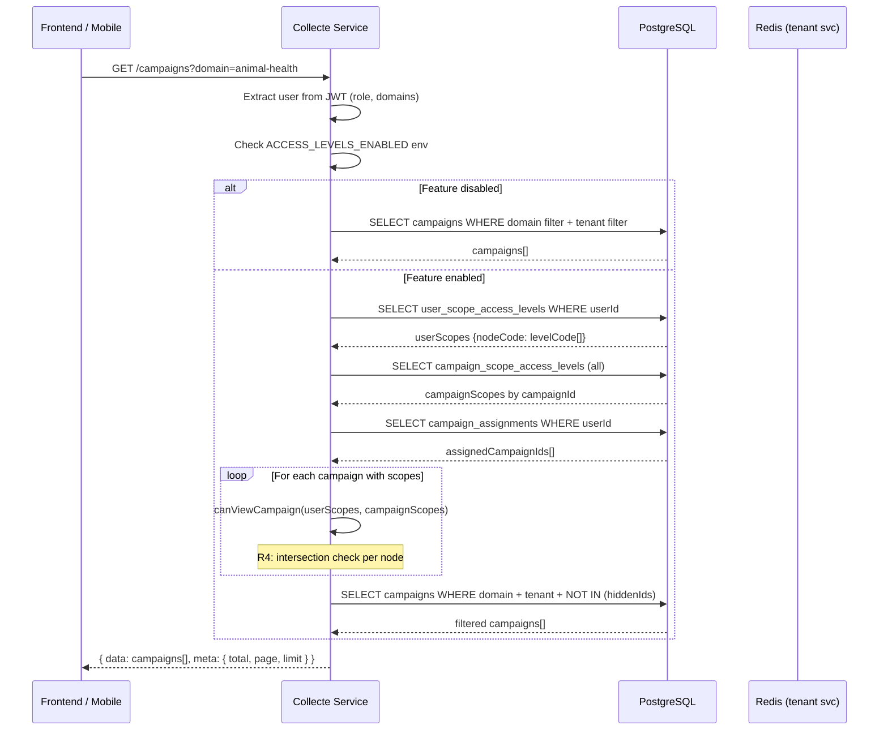
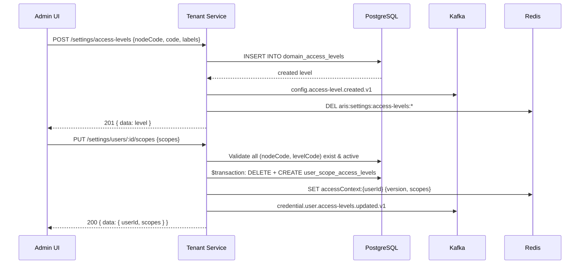
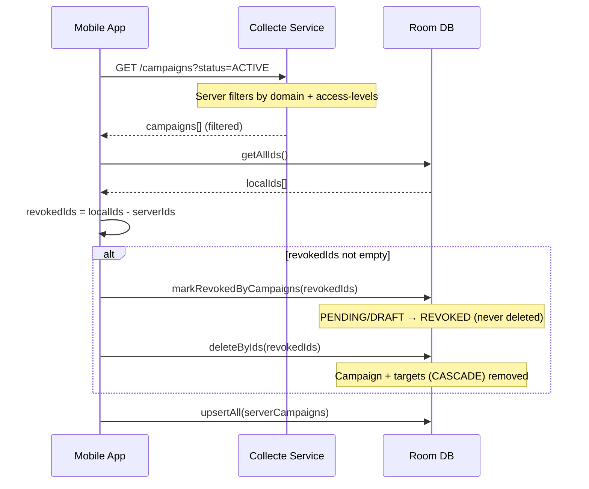

# Domain Access Levels — Architecture

**Version :** 1.0
**Date :** 2026-09-25
**Feature flag :** `ACCESS_LEVELS_ENABLED`

---

## 1. Vue d'ensemble

Les niveaux d'accès par domaine ajoutent un **second niveau de filtrage** aux campagnes ARIS. Au-delà de l'assignation domaine/sous-domaine, chaque noeud possède un catalogue de niveaux d'accès. Les utilisateurs et campagnes sont associés à ces niveaux ; la visibilité est calculée par intersection.

### Principes

| Règle | Description |
|-------|-------------|
| R1 | Pas d'héritage : les niveaux d'un domaine ne valent que pour ce domaine |
| R4 | Visibilité = au moins 1 noeud en commun avec intersection non vide (ou campagne ouverte) |
| R5 | Utilisateur sans niveaux sur un noeud → ne voit que les campagnes ouvertes |
| R6 | SUPER_ADMIN, CONTINENTAL_ADMIN et agents affectés contournent le filtre |
| R8 | Feature flag désactivé → comportement inchangé |
| R9 | Pas de suppression physique, désactivation uniquement |

---

## 2. Modèle de données

```
┌─────────────────────────┐       ┌──────────────────────────┐
│  DomainAccessLevel      │       │  UserScopeAccessLevel    │
│  (governance schema)    │       │  (public schema)         │
├─────────────────────────┤       ├──────────────────────────┤
│  id          UUID PK    │       │  userId    UUID           │
│  nodeCode    VARCHAR    │◄──────│  nodeCode  VARCHAR        │
│  code        VARCHAR    │       │  levelCode VARCHAR        │
│  labels      JSON       │       │  PK(userId,nodeCode,     │
│  isActive    BOOLEAN    │       │     levelCode)            │
│  sortOrder   INT        │       └──────────────────────────┘
│  UK(nodeCode, code)     │
└─────────────────────────┘       ┌──────────────────────────┐
                                  │ CampaignScopeAccessLevel │
                                  │  (public schema)         │
                                  ├──────────────────────────┤
                                  │  campaignId UUID          │
                                  │  nodeCode   VARCHAR       │
                                  │  levelCode  VARCHAR       │
                                  │  PK(campaignId,nodeCode,  │
                                  │     levelCode)            │
                                  └──────────────────────────┘
```

### nodeCode convention

| Type | Format | Exemple |
|------|--------|---------|
| Domaine | `{domain-code}` | `animal-health` |
| Sous-domaine | `{domain-code}.{SUBDOMAIN_CODE}` | `animal-health.PPR` |

---

## 3. Package partagé `@aris/access-control`

Exporte une **fonction pure** `canViewCampaign(input)` utilisée identiquement par tous les services.

```typescript
canViewCampaign({
  userNodeCodes: ["animal-health", "livestock-prod"],
  userScopes: { "animal-health": ["FIELD_LEVEL"] },
  campaignScopes: { "animal-health": ["FIELD_LEVEL", "MANAGEMENT"] },
  options: { userRole, isAssignedAgent, featureEnabled }
}) // → true (intersection non vide sur animal-health)
```

Exporte aussi `buildAccessLevelSqlFilter()` pour les requêtes SQL brutes, et les schémas Zod pour la validation.

---

## 4. Diagramme de séquence — Filtrage de la liste des campagnes



## 5. Diagramme de séquence — Administration des niveaux



## 6. Diagramme de séquence — Révocation mobile



---

## 7. Points d'accès filtrés (R7)

| # | Service | Endpoint | Méthode de filtrage |
|---|---------|----------|---------------------|
| 1 | Collecte | `GET /campaigns` | `buildFilter()` + `canViewCampaign()` |
| 2 | Collecte | `GET /campaigns/:id` | `canUserViewCampaign()` → 404 |
| 3 | Collecte | `GET /submissions` | `buildFilter()` + hidden campaign IDs |
| 4 | Collecte | `GET /submissions/:id` | Via campaign parent filter |
| 5 | Collecte | Workflow campaigns | `buildVisibilityFilter()` + `canViewCampaign()` |
| 6 | Collecte | `GET /sync/delta` | Domain SQL clause + access-level post-filter |
| 7 | Collecte | `POST /sync` (getServerUpdates) | Domain Prisma filter + `canViewCampaign()` |
| 8 | Analytics | `GET /domains/:code/summary` | `hasAccessToDomain()` → 404 |
| 9 | Analytics | `GET /:domainKey/kpis` | `hasAccessToDomain()` → 404 |
| 10 | Mobile | `refreshCampaigns()` | Server-filtered + reconciliation Room |

---

## 8. Topics Kafka

| Topic | Producteur | Consommateurs |
|-------|-----------|---------------|
| `sys.config.access-level.created.v1` | Tenant | — |
| `sys.config.access-level.updated.v1` | Tenant | — |
| `sys.config.access-level.deactivated.v1` | Tenant | — |
| `sys.credential.user.access-levels-updated.v1` | Tenant | (futur: invalidation cache) |
| `ms.collecte.campaign.access-levels-updated.v1` | Collecte | (futur: OpenSearch reindex) |

---

## 9. Cache Redis

| Clé | TTL | Contenu | Invalidation |
|-----|-----|---------|--------------|
| `accessContext:{userId}` | 600s | `{ version, scopes: Record<nodeCode, levelCode[]> }` | Sur `PUT /users/:id/scopes` |
| `aris:settings:access-levels:{nodeCode\|all}` | 300s | Liste des niveaux | Sur tout CRUD access-level |
| `aris:permissions:{userId}` | 900s | Permissions user | Sur modification scopes |

---

## 10. Feature flag

Variable d'environnement : `ACCESS_LEVELS_ENABLED=true|false`

- **`false` (défaut)** : `canViewCampaign()` retourne toujours `true`. Aucun filtrage.
- **`true`** : le filtre est actif. Les campagnes existantes sans scopes restent visibles (R8).

Pas de changement de schéma DB nécessaire pour activer/désactiver. Le flag contrôle uniquement la logique applicative.
