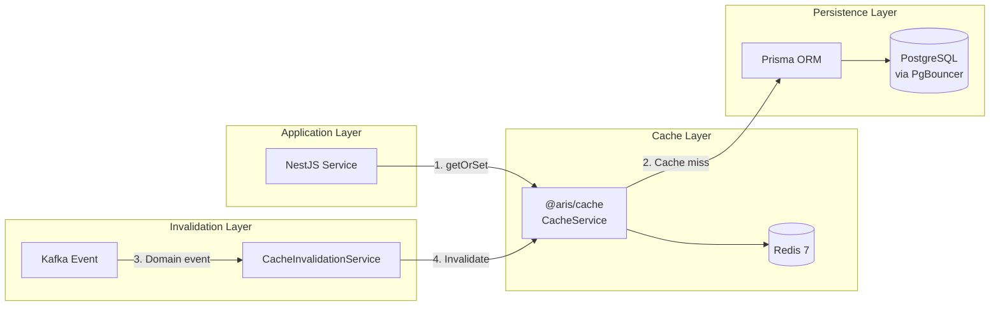
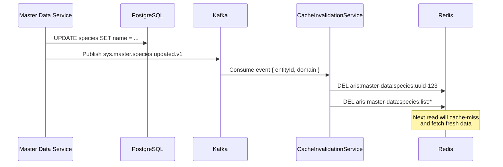

# Cache Strategy -- `@aris/cache`

> Centralized Redis cache architecture for ARIS 3.0.

---

## 1. Overview

ARIS uses a **cache-aside** (lazy-loading) pattern with Redis as the backing store. The `@aris/cache` package provides a unified caching layer for all 22 microservices, with domain-aware key patterns, configurable TTLs, Kafka-driven invalidation, and distributed locks.



### Cache-Aside Pattern

1. **Read**: Service calls `cacheService.getOrSet(key, ttl, fetchFn)`
2. **Cache hit**: Return cached value from Redis (fast path)
3. **Cache miss**: Execute `fetchFn` (Prisma query), store result in Redis, return value
4. **Write**: Service writes to PostgreSQL, publishes Kafka event
5. **Invalidate**: `CacheInvalidationService` consumes event, deletes relevant cache keys

---

## 2. Package Structure

```
packages/cache/
├── src/
│   ├── index.ts                    # Public exports
│   ├── cache.module.ts             # NestJS module (forRoot / forRootAsync)
│   ├── cache.service.ts            # Core CacheService (Redis operations)
│   ├── cache.config.ts             # Configuration, TTL defaults, key builders
│   ├── cache-invalidation.service.ts  # Kafka-driven invalidation
│   └── mock-cache.service.ts       # In-memory mock for unit tests
├── package.json
└── tsconfig.json
```

### Installation

```typescript
// In any NestJS service module
import { CacheModule } from '@aris/cache';

@Module({
  imports: [
    CacheModule.forRoot({
      url: process.env.REDIS_URL ?? 'redis://localhost:6379',
      keyPrefix: 'aris:',
      defaultTtlSeconds: 300,
    }),
  ],
})
export class AppModule {}
```

Async configuration (with dependency injection):

```typescript
CacheModule.forRootAsync({
  useFactory: (config: ConfigService) => ({
    url: config.get('REDIS_URL'),
    keyPrefix: 'aris:',
    defaultTtlSeconds: 300,
  }),
  inject: [ConfigService],
})
```

---

## 3. CacheService API

### Basic Operations

| Method | Signature | Description |
|--------|-----------|-------------|
| `get<T>` | `get<T>(key: string): Promise<T \| null>` | Get value by key |
| `set` | `set(key: string, value: any, ttl?: number): Promise<void>` | Set value with optional TTL |
| `getOrSet<T>` | `getOrSet<T>(key, ttl, fetchFn): Promise<T>` | Cache-aside: return cached or fetch and cache |
| `del` | `del(key: string): Promise<void>` | Delete a single key |
| `exists` | `exists(key: string): Promise<boolean>` | Check key existence |
| `ttl` | `ttl(key: string): Promise<number>` | Get remaining TTL in seconds |
| `expire` | `expire(key: string, seconds: number): Promise<void>` | Set expiry on existing key |

### Domain-Aware Operations

| Method | Signature | Description |
|--------|-----------|-------------|
| `setEntity` | `setEntity(domain, entity, id, value, ttl?)` | Store entity with domain key pattern |
| `getEntity<T>` | `getEntity<T>(domain, entity, id)` | Retrieve entity by domain key |
| `setList` | `setList(domain, entity, params, value, ttl?)` | Store paginated list result |
| `getList<T>` | `getList<T>(domain, entity, params)` | Retrieve cached list |
| `invalidateEntity` | `invalidateEntity(domain, entity, id)` | Delete entity + related list caches |
| `invalidateByPattern` | `invalidateByPattern(pattern)` | Delete all keys matching glob pattern |
| `delByPattern` | `delByPattern(pattern)` | Delete keys by pattern (SCAN + DEL) |

### Hash Operations

| Method | Signature | Description |
|--------|-----------|-------------|
| `hset` | `hset(key, field, value)` | Set hash field |
| `hget<T>` | `hget<T>(key, field)` | Get hash field |
| `hgetall<T>` | `hgetall<T>(key)` | Get all hash fields |
| `hdel` | `hdel(key, field)` | Delete hash field |

### Counters

| Method | Signature | Description |
|--------|-----------|-------------|
| `incr` | `incr(key)` | Increment counter |
| `incrWithTtl` | `incrWithTtl(key, ttl)` | Increment with auto-expiry (rate limiting) |

### Distributed Locks

| Method | Signature | Description |
|--------|-----------|-------------|
| `acquireLock` | `acquireLock(resource, ttlMs): Promise<string \| null>` | Acquire lock, returns token or null |
| `releaseLock` | `releaseLock(resource, token): Promise<boolean>` | Release lock (Lua script, token-safe) |

### Monitoring

| Method | Signature | Description |
|--------|-----------|-------------|
| `getStats` | `getStats()` | Return hit/miss counts and ratio |
| `resetStats` | `resetStats()` | Reset counters |
| `ping` | `ping()` | Redis connectivity check |
| `getClient` | `getClient()` | Access underlying ioredis client |

---

## 4. Key Patterns

All cache keys follow a consistent domain-aware pattern:

```
{prefix}{domain}:{entity}:{id}
```

### Examples

| Key | Description |
|-----|-------------|
| `aris:master-data:species:uuid-123` | Single species entity |
| `aris:master-data:diseases:list:page=1&limit=20` | Paginated disease list |
| `aris:animal-health:outbreak:uuid-456` | Single outbreak entity |
| `aris:credential:session:user-uuid` | User session data |
| `aris:analytics:dashboard:continental` | Dashboard KPI cache |
| `aris:rate-limit:login:192.168.1.1` | Rate limit counter |
| `aris:lock:import:master-data` | Distributed lock |

### Key Builder Functions

```typescript
import { buildCacheKey, buildListCacheKey, buildInvalidationPattern } from '@aris/cache';

// Entity key
buildCacheKey('master-data', 'species', 'uuid-123');
// → "aris:master-data:species:uuid-123"

// List key (with query params)
buildListCacheKey('master-data', 'species', { page: 1, limit: 20 });
// → "aris:master-data:species:list:page=1&limit=20"

// Invalidation pattern (glob)
buildInvalidationPattern('master-data', 'species');
// → "aris:master-data:species:*"
```

---

## 5. TTL Strategy

TTLs are configured per data category based on volatility and access patterns:

| Category | Constant | TTL | Rationale |
|----------|----------|-----|-----------|
| Master data | `DEFAULT_TTLS.MASTER_DATA` | 3,600s (1h) | Rarely changes, high read volume |
| Session data | `DEFAULT_TTLS.SESSION` | 1,800s (30min) | Aligned with JWT refresh cycle |
| Query results | `DEFAULT_TTLS.QUERY_RESULT` | 300s (5min) | Balance freshness vs. DB load |
| Dashboard KPIs | `DEFAULT_TTLS.DASHBOARD` | 120s (2min) | Near-real-time analytics |
| Rate limit counters | `DEFAULT_TTLS.RATE_LIMIT` | 60s (1min) | Short-lived sliding windows |
| Operational entities | (custom) | 600s (10min) | Per-service configuration |

### Configuration

```typescript
import { DEFAULT_TTLS } from '@aris/cache';

// Use in service
const species = await cacheService.getOrSet(
  buildCacheKey('master-data', 'species', id),
  DEFAULT_TTLS.MASTER_DATA,   // 3600s
  () => prisma.species.findUnique({ where: { id } }),
);
```

---

## 6. Kafka-Driven Invalidation

When data changes, the producing service publishes a Kafka event. The `CacheInvalidationService` consumes these events and invalidates relevant cache keys.



### Invalidation Scope

| Event | Keys Invalidated |
|-------|-----------------|
| Entity created | `{domain}:{entity}:list:*` (all list caches) |
| Entity updated | `{domain}:{entity}:{id}` + `{domain}:{entity}:list:*` |
| Entity deleted | `{domain}:{entity}:{id}` + `{domain}:{entity}:list:*` |
| Bulk import | `{domain}:{entity}:*` (full domain flush) |

### Subscribed Topics

```typescript
// CacheInvalidationService listens to:
'sys.master.geo.updated.v1'
'sys.master.species.updated.v1'
'sys.master.disease.updated.v1'
'sys.master.denominator.updated.v1'
'sys.credential.user.created.v1'
// ... additional domain events as needed
```

---

## 7. Distributed Locks

For operations that must not run concurrently (bulk imports, report generation, scheduled tasks), `@aris/cache` provides distributed locks using Redis `SET NX EX`.

### Usage

```typescript
const lockToken = await cacheService.acquireLock('import:master-data', 30_000); // 30s TTL

if (!lockToken) {
  throw new ConflictException('Import already in progress');
}

try {
  await performBulkImport();
} finally {
  await cacheService.releaseLock('import:master-data', lockToken);
}
```

### Implementation Details

- **Acquire**: `SET aris:lock:{resource} {token} NX EX {ttlSeconds}`
- **Release**: Lua script that checks token before deleting (prevents releasing another process's lock)
- **Token**: Random UUID generated per acquisition
- **Deadlock prevention**: TTL ensures locks are released even if the holder crashes

---

## 8. Testing

### MockCacheService

For unit tests, use `MockCacheService` which provides an in-memory Map-based implementation:

```typescript
import { MockCacheService } from '@aris/cache';

describe('MyService', () => {
  let cacheService: MockCacheService;

  beforeEach(() => {
    cacheService = new MockCacheService();
  });

  it('should cache entity', async () => {
    await cacheService.set('test-key', { id: '1', name: 'Test' });
    const result = await cacheService.get('test-key');
    expect(result).toEqual({ id: '1', name: 'Test' });
  });
});
```

### Integration Tests

For integration tests, use a real Redis instance via Testcontainers:

```typescript
import { GenericContainer, StartedTestContainer } from 'testcontainers';

let redis: StartedTestContainer;

beforeAll(async () => {
  redis = await new GenericContainer('redis:7-alpine')
    .withExposedPorts(6379)
    .start();

  process.env.REDIS_URL = `redis://${redis.getHost()}:${redis.getMappedPort(6379)}`;
});
```

---

## 9. Monitoring

### Hit/Miss Ratio

```typescript
const stats = await cacheService.getStats();
// { hits: 1542, misses: 203, hitRate: 0.884 }
```

### Redis Metrics (Prometheus)

Monitor these Redis metrics via Prometheus + Grafana:

| Metric | Description | Alert Threshold |
|--------|-------------|----------------|
| `redis_connected_clients` | Active connections | > 400 (approaching max) |
| `redis_used_memory_bytes` | Memory usage | > 400 MB (80% of 512 MB limit) |
| `redis_keyspace_hits` | Cache hits | - |
| `redis_keyspace_misses` | Cache misses | Hit ratio < 70% |
| `redis_evicted_keys` | Keys evicted by LRU | > 0 (consider increasing memory) |
| `redis_commands_processed_total` | Total commands | - |

### Grafana Dashboard Panels

1. **Cache Hit Rate** -- `redis_keyspace_hits / (redis_keyspace_hits + redis_keyspace_misses)`
2. **Memory Usage** -- `redis_used_memory_bytes` vs. `redis_maxmemory`
3. **Connected Clients** -- `redis_connected_clients` over time
4. **Command Latency** -- P50/P95/P99 of `redis_commands_duration_seconds`
5. **Eviction Rate** -- `rate(redis_evicted_keys[5m])`

---

## 10. Best Practices

1. **Always use domain-aware keys** -- Never use raw string keys. Use `buildCacheKey()` for consistency.
2. **Set appropriate TTLs** -- Use `DEFAULT_TTLS` constants. Don't cache without expiry.
3. **Invalidate on write** -- Publish Kafka events on every mutation. Let `CacheInvalidationService` handle cleanup.
4. **Use `getOrSet` for reads** -- This is the primary cache-aside pattern. Avoid manual get/set sequences.
5. **Distributed locks for exclusivity** -- Use `acquireLock`/`releaseLock` for bulk operations, not Redis transactions.
6. **Mock in unit tests** -- Use `MockCacheService` to avoid Redis dependencies in unit tests.
7. **Monitor hit rates** -- A hit rate below 70% indicates misconfigured TTLs or unnecessary caching.
8. **Don't cache PII** -- Avoid caching personally identifiable information. Cache aggregated/anonymized data.

---

## Related Documentation

- [PGBOUNCER.md](./PGBOUNCER.md) -- Connection pooling (complementary infrastructure)
- [OVERVIEW.md](./OVERVIEW.md) -- System architecture overview
- [SECURITY.md](./SECURITY.md) -- Security architecture (Redis isolation)
