# ARIS 4.0 Data Model Reference

> **Version:** 1.0.0 | **Date:** 2026-02-20 | **Status:** Living Document
>
> Comprehensive entity-relationship documentation for the Animal Resources Information System (ARIS 4.0),
> the AU-IBAR continental digital infrastructure serving 55 Member States and 8 RECs.

---

## Table of Contents

1. [Summary Statistics](#1-summary-statistics)
2. [Schema Overview](#2-schema-overview)
3. [Enumerations Reference](#3-enumerations-reference)
4. [Domain 1 -- Platform Core (public schema)](#4-domain-1----platform-core)
5. [Domain 2 -- Master Data Referentials (public schema)](#5-domain-2----master-data-referentials)
6. [Domain 3 -- Data Quality (public schema)](#6-domain-3----data-quality)
7. [Domain 4 -- Notifications and Storage (public schema)](#7-domain-4----notifications-and-storage)
8. [Domain 5 -- Collection and Campaigns (public schema)](#8-domain-5----collection-and-campaigns)
9. [Domain 6 -- Form Builder (form_builder schema)](#9-domain-6----form-builder)
10. [Domain 7 -- Data Contracts (data_contract schema)](#10-domain-7----data-contracts)
11. [Domain 8 -- Workflow Engine (workflow schema)](#11-domain-8----workflow-engine)
12. [Domain 9 -- Geo Services (geo_services schema)](#12-domain-9----geo-services)
13. [Domain 10 -- Animal Health (animal_health schema)](#13-domain-10----animal-health)
14. [Domain 11 -- Livestock Production (livestock schema)](#14-domain-11----livestock-production)
15. [Domain 12 -- Knowledge Hub (knowledge_hub schema)](#15-domain-12----knowledge-hub)
16. [Domain 13 -- Interoperability Hub (interop_hub schema)](#16-domain-13----interoperability-hub)
17. [Cross-Domain Relationships](#17-cross-domain-relationships)
18. [Multi-Tenant Data Isolation](#18-multi-tenant-data-isolation)
19. [Indexing Strategy](#19-indexing-strategy)
20. [Migration and Versioning](#20-migration-and-versioning)

---

## 1. Summary Statistics

| Metric                    | Count |
| ------------------------- | ----- |
| **Prisma Models**         | 41    |
| **PostgreSQL Schemas**    | 8     |
| **Enumerations**          | 34    |
| **Foreign Key Relations** | 60+   |
| **Unique Constraints**    | 12    |
| **Self-Referential FKs**  | 3     |
| **PostGIS Geometry Cols** | 2     |
| **JSON/JSONB Columns**    | 25+   |

### Models per Schema

| Schema            | Models | Primary Domain                     |
| ----------------- | ------ | ---------------------------------- |
| `public`          | 19     | Platform, Master Data, Quality, Collection |
| `form_builder`    | 1      | No-Code Form Templates             |
| `data_contract`   | 2      | Data Governance Contracts          |
| `workflow`        | 2      | 4-Level Validation Engine          |
| `geo_services`    | 3      | Geospatial and Map Layers          |
| `animal_health`   | 5      | Disease Surveillance and Response  |
| `livestock`       | 4      | Census, Production, Trade Routes   |
| `knowledge_hub`   | 4      | Publications, E-Learning, FAQs    |
| `interop_hub`     | 4      | WAHIS, EMPRES, FAOSTAT Connectors  |
| **Total**         | **44** | *(41 unique models + 3 service-local)* |

> **Note:** The `livestock` schema contains 4 service-local models managed by the `livestock-prod` service.
> Combined with the 8 shared schemas this yields 41 core models documented here plus 3 additional
> service-local models for a total of 44 table definitions.

---

## 2. Schema Overview

```
PostgreSQL 16 + PostGIS 3.4
 |
 |-- public                  Platform Core + Master Data + Quality + Collection
 |    |-- Tenant, User
 |    |-- GeoEntity, Species, Disease, Unit, Temporality, Identifier, Denominator
 |    |-- MasterDataAudit
 |    |-- QualityReport, QualityGateResult, QualityViolation, CorrectionTracker, CustomQualityRule
 |    |-- Notification, FileRecord
 |    |-- Campaign, Submission, SyncLog
 |
 |-- form_builder            No-Code Form Engine
 |    |-- FormTemplate
 |
 |-- data_contract           Data Governance
 |    |-- DataContract, ComplianceRecord
 |
 |-- workflow                4-Level Validation
 |    |-- WorkflowInstance, WorkflowTransition
 |
 |-- geo_services            Geospatial
 |    |-- MapLayer, AdminBoundary, GeoEvent
 |
 |-- animal_health           Disease Surveillance
 |    |-- HealthEvent, LabResult, SurveillanceActivity, VaccinationCampaign, SVCapacity
 |
 |-- livestock               Livestock Production (service-local)
 |    |-- LivestockCensus, ProductionRecord, SlaughterRecord, TranshumanceCorridor
 |
 |-- knowledge_hub           Knowledge Management
 |    |-- Publication, ELearningModule, LearnerProgress, FAQ
 |
 |-- interop_hub             External System Connectors
 |    |-- ExportRecord, FeedRecord, SyncRecord, ConnectorConfig
```

---

## 3. Enumerations Reference

ARIS uses **34 enumerations** across its data model. Each enum is defined in `@aris/shared-types` and
mapped to PostgreSQL enums via Prisma.

### 3.1 Identity and Access

| Enum               | Values                                                                                                              |
| ------------------- | ------------------------------------------------------------------------------------------------------------------- |
| `TenantLevel`       | `CONTINENTAL`, `REC`, `MEMBER_STATE`                                                                                |
| `UserRole`          | `SUPER_ADMIN`, `CONTINENTAL_ADMIN`, `REC_ADMIN`, `NATIONAL_ADMIN`, `DATA_STEWARD`, `WAHIS_FOCAL_POINT`, `ANALYST`, `FIELD_AGENT` |
| `DataClassification`| `PUBLIC`, `PARTNER`, `RESTRICTED`, `CONFIDENTIAL`                                                                   |

### 3.2 Master Data

| Enum                | Values                                                                  |
| -------------------- | ----------------------------------------------------------------------- |
| `GeoLevel`           | `COUNTRY`, `ADMIN1`, `ADMIN2`, `ADMIN3`, `SPECIAL_ZONE`               |
| `SpeciesCategory`    | `DOMESTIC`, `WILDLIFE`, `AQUATIC`, `APICULTURE`                        |
| `UnitCategory`       | `COUNT`, `WEIGHT`, `VOLUME`, `AREA`, `DISTANCE`, `TEMPERATURE`, `CURRENCY`, `PERCENTAGE`, `RATE` |
| `IdentifierType`     | `LAB`, `MARKET`, `BORDER_POINT`, `PROTECTED_AREA`, `PORT`, `SLAUGHTERHOUSE`, `QUARANTINE_STATION` |
| `DenominatorSource`  | `FAOSTAT`, `NATIONAL_CENSUS`, `ESTIMATE`                              |

### 3.3 Data Quality

| Enum                  | Values                                                                 |
| ---------------------- | ---------------------------------------------------------------------- |
| `QualityOverallStatus` | `PASSED`, `FAILED`, `WARNING`                                         |
| `QualityGate`          | `COMPLETENESS`, `TEMPORAL_CONSISTENCY`, `GEOGRAPHIC_CONSISTENCY`, `CODES_VOCABULARIES`, `UNITS`, `DEDUPLICATION`, `AUDITABILITY`, `CONFIDENCE_SCORE` |
| `QualityGateStatus`    | `PASS`, `FAIL`, `WARNING`, `SKIPPED`                                  |
| `ViolationSeverity`    | `ERROR`, `WARNING`, `INFO`                                            |
| `CorrectionStatus`     | `PENDING`, `IN_PROGRESS`, `CORRECTED`, `ESCALATED`, `EXPIRED`         |

### 3.4 Notifications and Files

| Enum                   | Values                                                               |
| ----------------------- | -------------------------------------------------------------------- |
| `NotificationChannel`   | `EMAIL`, `SMS`, `PUSH`, `IN_APP`                                    |
| `NotificationStatus`    | `PENDING`, `SENT`, `DELIVERED`, `READ`, `FAILED`                    |
| `FileScanStatus`        | `PENDING`, `CLEAN`, `INFECTED`, `ERROR`                             |
| `FileStatus`            | `ACTIVE`, `ARCHIVED`, `DELETED`                                     |

### 3.5 Collection and Campaigns

| Enum                  | Values                                                                |
| ---------------------- | --------------------------------------------------------------------- |
| `CampaignStatus`       | `PLANNED`, `ACTIVE`, `COMPLETED`, `CANCELLED`                        |
| `ConflictStrategy`     | `LAST_WRITE_WINS`, `MANUAL_MERGE`, `SERVER_PRIORITY`                 |
| `SubmissionStatus`     | `DRAFT`, `SUBMITTED`, `VALIDATING`, `VALIDATED`, `REJECTED`          |

### 3.6 Forms and Contracts

| Enum                    | Values                                                              |
| ------------------------ | ------------------------------------------------------------------- |
| `FormTemplateStatus`     | `DRAFT`, `PUBLISHED`, `ARCHIVED`                                   |
| `DataContractStatus`     | `DRAFT`, `ACTIVE`, `DEPRECATED`, `ARCHIVED`                        |
| `OfficialityLevel`       | `OFFICIAL`, `ANALYTICAL`, `EXPERIMENTAL`                           |
| `ExchangeMechanism`      | `KAFKA`, `API`, `FILE_UPLOAD`, `MANUAL`                            |
| `ComplianceEventType`    | `SUBMISSION`, `QUALITY_CHECK`, `TIMELINESS_CHECK`, `SLA_BREACH`    |

### 3.7 Workflow

| Enum                    | Values                                                              |
| ------------------------ | ------------------------------------------------------------------- |
| `WorkflowLevel`          | `LEVEL_1_NATIONAL_STEWARD`, `LEVEL_2_DATA_OWNER`, `LEVEL_3_REC`, `LEVEL_4_AU_IBAR` |
| `WorkflowStatus`         | `PENDING`, `IN_REVIEW`, `APPROVED`, `REJECTED`, `ESCALATED`, `COMPLETED` |
| `WorkflowAction`         | `SUBMIT`, `APPROVE`, `REJECT`, `ESCALATE`, `RETURN`               |

### 3.8 Animal Health

| Enum                    | Values                                                              |
| ------------------------ | ------------------------------------------------------------------- |
| `HealthEventType`        | `OUTBREAK`, `SUSPECTED_CASE`, `CONFIRMED_CASE`, `RESOLVED`         |
| `ConfidenceLevel`        | `RUMOR`, `VERIFIED`, `CONFIRMED`                                   |
| `LabResultOutcome`       | `POSITIVE`, `NEGATIVE`, `INCONCLUSIVE`                             |
| `SurveillanceType`       | `PASSIVE`, `ACTIVE`, `SENTINEL`, `EVENT_BASED`                     |
| `SurveillanceDesign`     | `RANDOM`, `RISK_BASED`, `CENSUS`, `CONVENIENCE`                    |

### 3.9 Interoperability

| Enum                    | Values                                                              |
| ------------------------ | ------------------------------------------------------------------- |
| `ConnectorType`          | `WAHIS`, `EMPRES`, `FAOSTAT`, `FISHSTATJ`, `CITES`, `WDPA`, `GBIF` |
| `InteropStatus`          | `PENDING`, `IN_PROGRESS`, `SUCCESS`, `PARTIAL`, `FAILED`           |
| `ExportFormat`           | `JSON`, `XML`, `CSV`, `GEOJSON`                                    |

### 3.10 Geo Services

| Enum                    | Values                                                              |
| ------------------------ | ------------------------------------------------------------------- |
| `MapLayerType`           | `BASE`, `OVERLAY`, `THEMATIC`, `RISK`                              |
| `GeometryType`           | `POINT`, `LINESTRING`, `POLYGON`, `MULTIPOLYGON`                   |

---

## 4. Domain 1 -- Platform Core

**Schema:** `public` | **Owner:** CC-1 (Platform Core) | **Models:** Tenant, User

The platform core establishes multi-tenant identity. Every entity in the system references a tenant,
and every API call carries a `tenantId` extracted from the JWT.

### ER Diagram

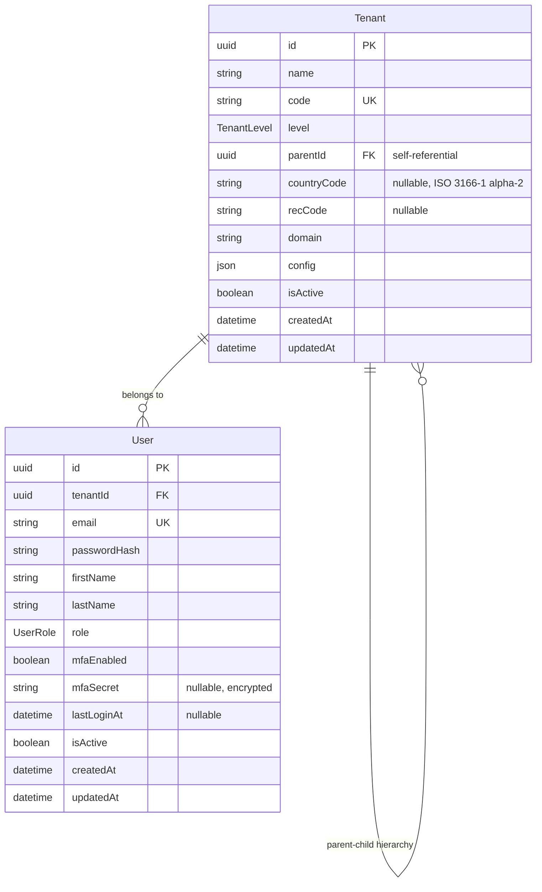

### Tenant Hierarchy

```
AU-IBAR (CONTINENTAL, parentId=null)
  +-- IGAD (REC, parentId=AU-IBAR)
  |     +-- Kenya (MEMBER_STATE, parentId=IGAD, countryCode=KE)
  |     +-- Ethiopia (MEMBER_STATE, parentId=IGAD, countryCode=ET)
  |     +-- ...
  +-- ECOWAS (REC, parentId=AU-IBAR)
  |     +-- Nigeria (MEMBER_STATE, parentId=ECOWAS, countryCode=NG)
  |     +-- ...
  +-- SADC (REC, parentId=AU-IBAR)
        +-- ...
```

### Key Constraints

- `Tenant.code` is unique across the system.
- `User.email` is globally unique.
- `Tenant.parentId` is nullable (root tenant AU-IBAR has `parentId = null`).
- `User.tenantId` is required (every user belongs to exactly one tenant).
- Passwords are hashed with bcrypt; MFA secrets are encrypted at rest.

---

## 5. Domain 2 -- Master Data Referentials

**Schema:** `public` | **Owner:** CC-2 (Data Hub) | **Models:** GeoEntity, Species, Disease, Unit, Temporality, Identifier, Denominator, MasterDataAudit

Master Data referentials are the single source of truth for all coded values used across the system.
They are versioned, immutable once published, and audited via `MasterDataAudit`.

### ER Diagram

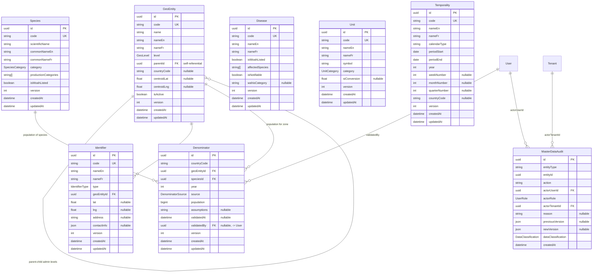

### Unique Constraints

| Model         | Unique Constraint                                  |
| ------------- | -------------------------------------------------- |
| `Denominator` | `(countryCode, speciesId, year, source)`           |

### Versioning

All master data entities carry a `version` integer that increments on every update. The previous
state is captured in `MasterDataAudit.previousVersion` (JSONB) before each mutation, providing
a full history of changes.

### GeoEntity Hierarchy

```
Country (level=COUNTRY, e.g., "Kenya")
  +-- Admin Level 1 (level=ADMIN1, e.g., "Rift Valley Province")
  |     +-- Admin Level 2 (level=ADMIN2, e.g., "Nakuru County")
  |           +-- Admin Level 3 (level=ADMIN3, e.g., "Nakuru Sub-County")
  +-- Special Zone (level=SPECIAL_ZONE, e.g., "Maasai Mara Ecosystem")
```

---

## 6. Domain 3 -- Data Quality

**Schema:** `public` | **Owner:** CC-2 (Data Hub) | **Models:** QualityReport, QualityGateResult, QualityViolation, CorrectionTracker, CustomQualityRule

The Data Quality subsystem implements the 8 mandatory quality gates defined in Annex B, section B4.2.
Every record entering the system is assessed, scored, and either accepted or routed through the
correction loop.

### ER Diagram

```mermaid
erDiagram
    QualityReport {
        uuid id PK
        uuid recordId
        string entityType
        string domain
        uuid tenantId FK
        QualityOverallStatus overallStatus
        int totalDurationMs
        datetime checkedAt
        uuid submittedBy FK "-> User"
        uuid dataContractId FK "nullable"
        datetime createdAt
        datetime updatedAt
    }

    QualityGateResult {
        uuid id PK
        uuid reportId FK
        QualityGate gate
        QualityGateStatus status
        int durationMs
        datetime createdAt
    }

    QualityViolation {
        uuid id PK
        uuid reportId FK
        QualityGate gate
        string field
        string message
        ViolationSeverity severity
        datetime createdAt
    }

    CorrectionTracker {
        uuid id PK
        uuid reportId FK "unique"
        CorrectionStatus status
        datetime correctionDeadline
        datetime escalationDeadline "nullable"
        datetime correctedAt "nullable"
        datetime escalatedAt "nullable"
        datetime notifiedAt "nullable"
        uuid assignedTo FK "nullable, -> User"
        datetime createdAt
        datetime updatedAt
    }

    CustomQualityRule {
        uuid id PK
        string domain
        string entityType
        uuid tenantId FK
        string name
        string description "nullable"
        QualityGate gate
        json config
        boolean isActive
        uuid createdBy FK "-> User"
        datetime createdAt
        datetime updatedAt
    }

    QualityReport ||--o{ QualityGateResult : "has gate results"
    QualityReport ||--o{ QualityViolation : "has violations"
    QualityReport ||--|| CorrectionTracker : "correction loop"
    Tenant ||--o{ QualityReport : "belongs to"
    Tenant ||--o{ CustomQualityRule : "scoped to"
    User ||--o{ CorrectionTracker : "assignedTo"
```

### The 8 Quality Gates

| # | Gate                      | Description                                              |
| - | ------------------------- | -------------------------------------------------------- |
| 1 | `COMPLETENESS`            | All key fields filled (domain-specific rules)            |
| 2 | `TEMPORAL_CONSISTENCY`    | Date ordering (confirmation >= suspicion, etc.)          |
| 3 | `GEOGRAPHIC_CONSISTENCY`  | Admin codes valid; coordinates within boundaries         |
| 4 | `CODES_VOCABULARIES`      | Species/diseases/zones exist in master data              |
| 5 | `UNITS`                   | Valid and consistent (SI + sectoral)                     |
| 6 | `DEDUPLICATION`           | Deterministic + probabilistic matching                   |
| 7 | `AUDITABILITY`            | Source system + responsible unit + validation status      |
| 8 | `CONFIDENCE_SCORE`        | Auto-calculated confidence (rumor/verified/confirmed)    |

### Correction Loop Flow

```
Record submitted
     |
     v
QualityReport created (8 gates evaluated)
     |
     +--[PASSED]--> Record proceeds to Workflow
     |
     +--[FAILED]--> CorrectionTracker created
                        |
                        +--[PENDING]-- Notification sent to assignee
                        |
                        +--[IN_PROGRESS]-- Data steward correcting
                        |
                        +--[CORRECTED]-- Re-evaluated through gates
                        |
                        +--[ESCALATED]-- SLA breach, escalated to supervisor
                        |
                        +--[EXPIRED]-- Deadline passed, record archived
```

---

## 7. Domain 4 -- Notifications and Storage

**Schema:** `public` | **Owner:** CC-1 (Platform Core) | **Models:** Notification, FileRecord

### ER Diagram

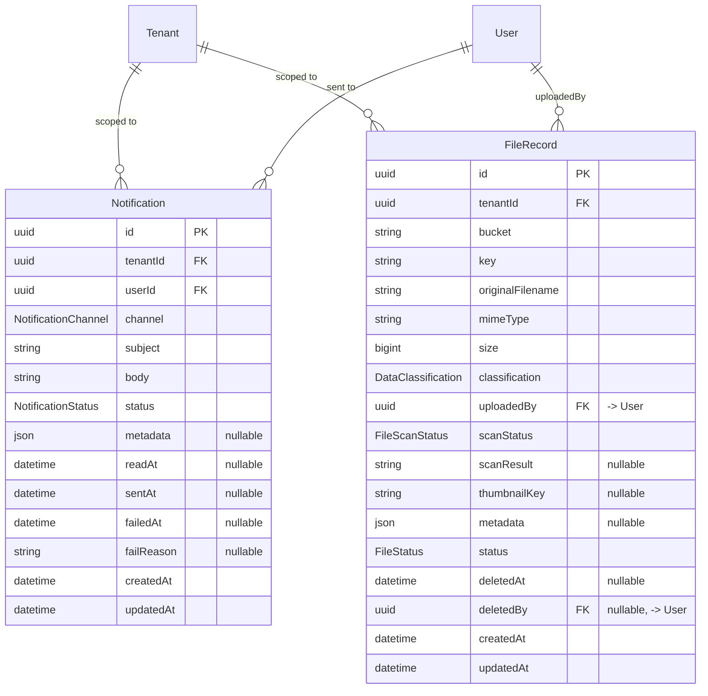

### Unique Constraints

| Model        | Unique Constraint     |
| ------------ | --------------------- |
| `FileRecord` | `(bucket, key)`       |

### File Lifecycle

Files are stored in MinIO (S3-compatible object storage). The `FileRecord` model tracks metadata,
antivirus scan status, and data classification. Soft deletion is used (`deletedAt`, `deletedBy`)
with a configurable retention period before permanent removal.

---

## 8. Domain 5 -- Collection and Campaigns

**Schema:** `public` | **Owner:** CC-3 (Collecte and Workflow) | **Models:** Campaign, Submission, SyncLog

The collection subsystem manages data collection campaigns for field agents, supporting offline-first
mobile data entry with GPS coordinates and conflict resolution.

### ER Diagram

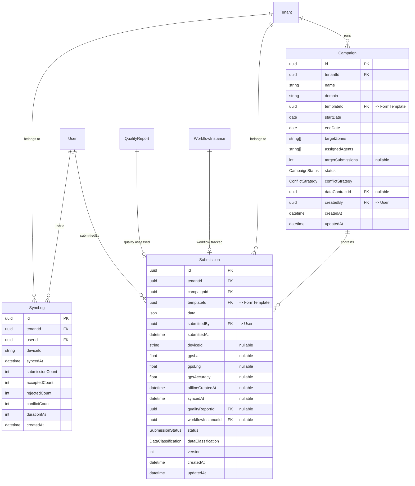

### Offline Sync Strategy

```
Mobile Device (offline)                    Server
     |                                       |
     |-- Create submission locally           |
     |   (offlineCreatedAt = device time)    |
     |                                       |
     |-- [Connection restored] ---------->   |
     |   Batch sync (SyncLog created)        |
     |                                       |
     |   <-- Conflict resolution -->         |
     |   Strategy: LAST_WRITE_WINS |         |
     |             MANUAL_MERGE    |         |
     |             SERVER_PRIORITY           |
     |                                       |
     |-- syncedAt = server time              |
```

---

## 9. Domain 6 -- Form Builder

**Schema:** `form_builder` | **Owner:** CC-3 (Collecte and Workflow) | **Models:** FormTemplate

The form builder provides a no-code, JSON Schema-based form definition system with versioning
and template inheritance.

### ER Diagram

```mermaid
erDiagram
    FormTemplate {
        uuid id PK
        uuid tenantId FK "-> public.Tenant"
        string name
        string domain
        int version
        uuid parentTemplateId FK "nullable, self-referential"
        json schema "JSON Schema definition"
        json uiSchema "UI rendering hints"
        uuid dataContractId FK "nullable, -> data_contract.DataContract"
        FormTemplateStatus status
        DataClassification dataClassification
        uuid createdBy FK "-> public.User"
        uuid updatedBy FK "nullable, -> public.User"
        datetime publishedAt "nullable"
        datetime archivedAt "nullable"
        datetime createdAt
        datetime updatedAt
    }

    FormTemplate ||--o{ FormTemplate : "parent template versioning"
```

### Unique Constraints

| Model          | Unique Constraint              |
| -------------- | ------------------------------ |
| `FormTemplate` | `(tenantId, name, version)`    |

### Template Lifecycle

```
DRAFT --> PUBLISHED --> ARCHIVED
  ^          |
  |          |  (new version created)
  +----------+
```

- Templates in `DRAFT` can be edited freely.
- `PUBLISHED` templates are immutable; any change requires a new version.
- `ARCHIVED` templates remain accessible for historical submissions but cannot be used in new campaigns.

---

## 10. Domain 7 -- Data Contracts

**Schema:** `data_contract` | **Owner:** CC-2 (Data Hub) | **Models:** DataContract, ComplianceRecord

Data contracts formalize the agreement between data producers (Member States) and consumers
(REC/AU-IBAR/external systems). They define schema, frequency, SLA, and quality expectations.

### ER Diagram

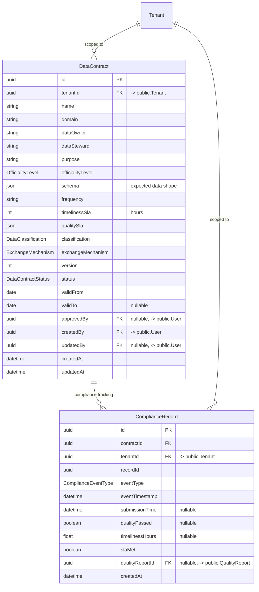

### Unique Constraints

| Model          | Unique Constraint              |
| -------------- | ------------------------------ |
| `DataContract` | `(tenantId, name, version)`    |

### Contract and Quality Pipeline Integration

```
DataContract
     |
     +-- Defines expected schema, frequency, quality SLA
     |
     +-- FormTemplate.dataContractId --> Forms bound to contracts
     |
     +-- Campaign.dataContractId ------> Campaigns bound to contracts
     |
     +-- QualityReport.dataContractId -> Quality checks reference contract
     |
     +-- ComplianceRecord --------------> SLA monitoring and audit
```

---

## 11. Domain 8 -- Workflow Engine

**Schema:** `workflow` | **Owner:** CC-3 (Collecte and Workflow) | **Models:** WorkflowInstance, WorkflowTransition

The workflow engine implements the 4-level validation pipeline mandated by Annex B, section B4.1.
It tracks every state transition with full audit trail.

### ER Diagram

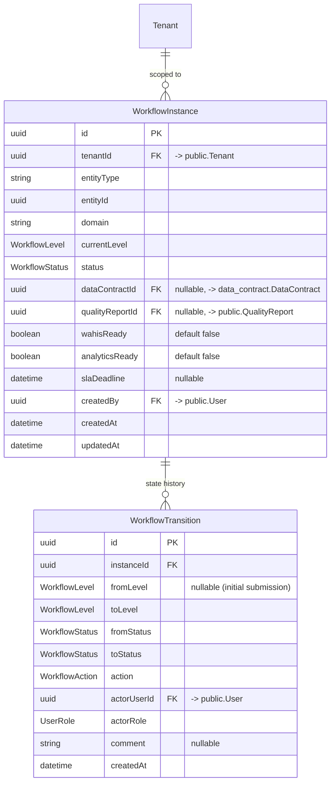

### 4-Level Validation Flow

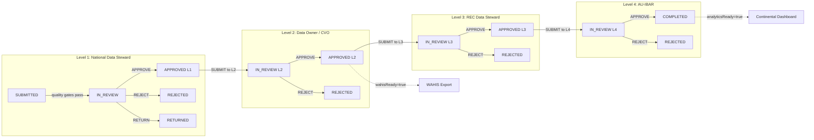

### Publication Tracks

| Track          | Triggered At | Flag              | Consumer                      |
| -------------- | ------------ | ----------------- | ----------------------------- |
| **Official**   | Level 2      | `wahisReady`      | WAHIS Focal Point for export  |
| **Analytical** | Level 4      | `analyticsReady`  | AU-IBAR dashboards and briefs |

---

## 12. Domain 9 -- Geo Services

**Schema:** `geo_services` | **Owner:** CC-4 (Domain Services) | **Models:** MapLayer, AdminBoundary, GeoEvent

The geo services domain manages spatial data using PostGIS 3.4, including administrative boundaries,
thematic map layers, and georeferenced domain events.

### ER Diagram

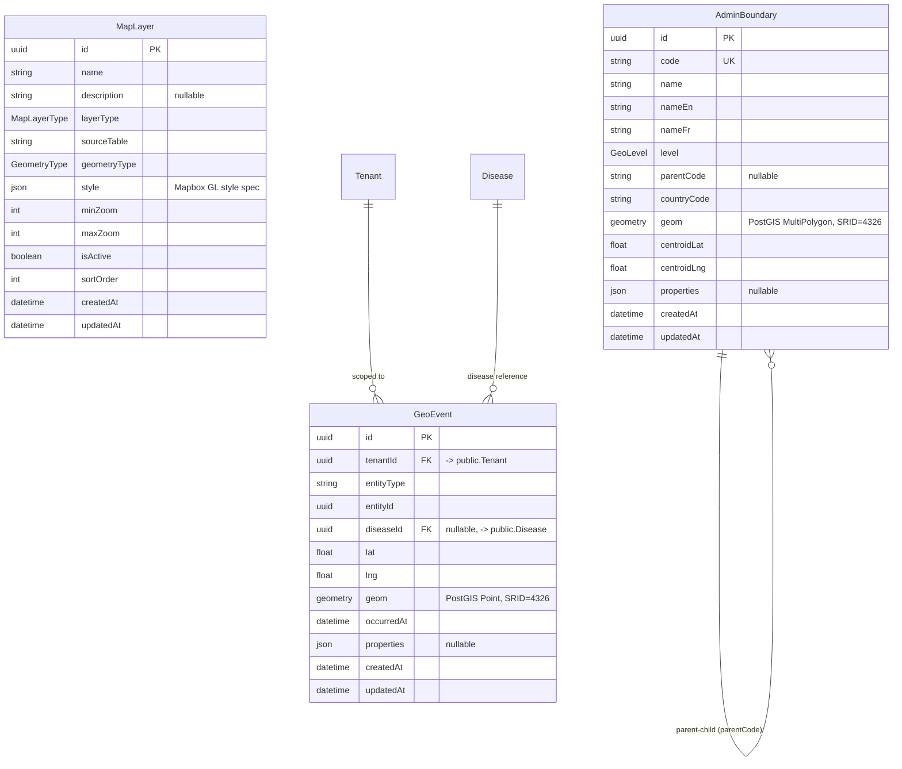

### PostGIS Geometry Columns

| Model            | Column  | Type            | SRID |
| ---------------- | ------- | --------------- | ---- |
| `AdminBoundary`  | `geom`  | `MultiPolygon`  | 4326 |
| `GeoEvent`       | `geom`  | `Point`         | 4326 |

### Spatial Queries

The `AdminBoundary` model mirrors the `GeoEntity` hierarchy from master data but adds actual
geometry for spatial operations (containment, intersection, distance, buffer). The `GeoEvent`
model is a denormalized projection of domain events (outbreaks, surveillance) for fast map
rendering via `pg_tileserv` vector tiles.

---

## 13. Domain 10 -- Animal Health

**Schema:** `animal_health` | **Owner:** CC-4 (Domain Services) | **Models:** HealthEvent, LabResult, SurveillanceActivity, VaccinationCampaign, SVCapacity

Animal health is the most complex domain, covering disease surveillance, outbreak response,
laboratory diagnostics, vaccination campaigns, and veterinary service capacity assessment.

### ER Diagram

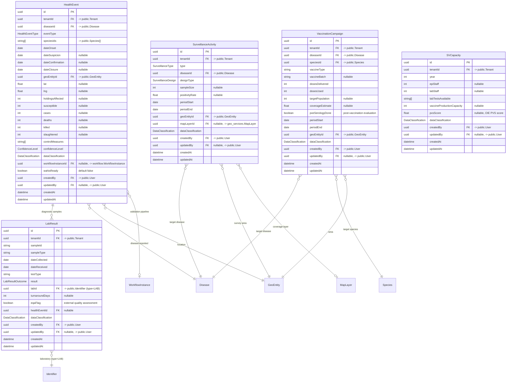

### Unique Constraints

| Model        | Unique Constraint       |
| ------------ | ----------------------- |
| `SVCapacity` | `(tenantId, year)`      |

### WAHIS Integration Points

The `wahisReady` flag on `HealthEvent` is set to `true` when the record passes Level 2 validation
(Data Owner / CVO approval). At that point, the WAHIS Focal Point can trigger an export via the
Interop Hub. The mapping to WAHIS XML/JSON is handled by the `interop_hub.ExportRecord` model.

### Date Ordering (Quality Gate: Temporal Consistency)

```
dateOnset <= dateSuspicion <= dateConfirmation <= dateClosure
```

This ordering is enforced by the `TEMPORAL_CONSISTENCY` quality gate and must hold for every
`HealthEvent` record.

---

## 14. Domain 11 -- Livestock Production

**Schema:** `livestock` (service-local) | **Owner:** CC-4 (Domain Services) | **Models:** LivestockCensus, ProductionRecord, SlaughterRecord, TranshumanceCorridor

The livestock production domain covers animal census, production statistics, slaughter monitoring,
and transhumance corridor mapping.

### ER Diagram

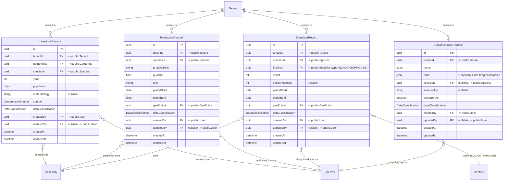

### Unique Constraints

| Model              | Unique Constraint                                |
| ------------------ | ------------------------------------------------ |
| `LivestockCensus`  | `(tenantId, geoEntityId, speciesId, year)`       |

### Census vs Denominator

`LivestockCensus` (livestock schema) records raw census data submitted by Member States.
`Denominator` (public schema) stores the harmonized, validated figures used across the platform
for rate calculations. The reconciliation between national census data and FAOSTAT denominators
is tracked by the `source` field and documented in `assumptions`.

---

## 15. Domain 12 -- Knowledge Hub

**Schema:** `knowledge_hub` | **Owner:** CC-4 (Domain Services) | **Models:** Publication, ELearningModule, LearnerProgress, FAQ

The knowledge hub manages the AU-IBAR knowledge management infrastructure, including the
e-repository, e-learning platform, and FAQ system.

### ER Diagram

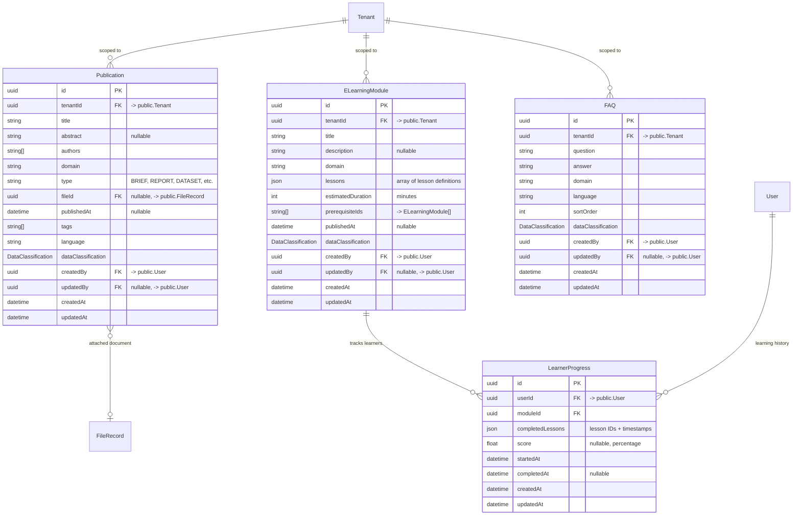

### Unique Constraints

| Model              | Unique Constraint        |
| ------------------ | ------------------------ |
| `LearnerProgress`  | `(userId, moduleId)`     |

---

## 16. Domain 13 -- Interoperability Hub

**Schema:** `interop_hub` | **Owner:** CC-2 (Data Hub) | **Models:** ExportRecord, FeedRecord, SyncRecord, ConnectorConfig

The interoperability hub manages all data exchange with external systems (WAHIS, EMPRES, FAOSTAT,
FishStatJ, CITES, WDPA, GBIF). Each connector type has its own record model tracking export/import
status and payloads.

### ER Diagram

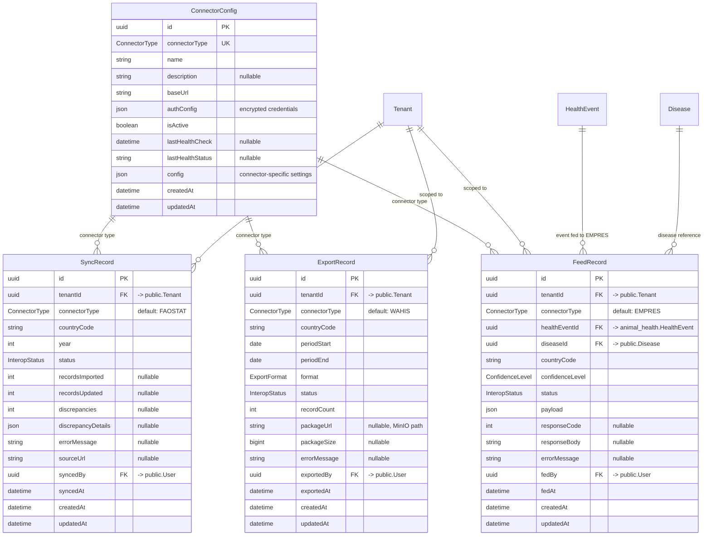

### Connector Types and Default Mappings

| Connector     | Record Model    | Direction | Default Format | Frequency          |
| ------------- | --------------- | --------- | -------------- | ------------------ |
| **WAHIS**     | `ExportRecord`  | Export    | JSON/XML       | Near-real-time + periodic |
| **EMPRES**    | `FeedRecord`    | Export    | JSON           | Near-real-time     |
| **FAOSTAT**   | `SyncRecord`    | Import    | CSV/JSON       | Annual + updates   |
| **FishStatJ** | `SyncRecord`    | Import    | CSV/JSON       | Annual             |
| **CITES**     | `SyncRecord`    | Both      | GeoJSON/API    | Quarterly          |
| **WDPA**      | `SyncRecord`    | Import    | GeoJSON        | Quarterly          |
| **GBIF**      | `SyncRecord`    | Import    | API            | Quarterly          |

### Health Check Monitoring

Each `ConnectorConfig` records the last health check timestamp and status. The system periodically
pings external endpoints and updates these fields. Unhealthy connectors trigger notifications
to system administrators.

---

## 17. Cross-Domain Relationships

The following diagram shows the major relationships that cross schema boundaries. These are the
critical integration points where data flows between domains.

### Full Cross-Domain ER Diagram

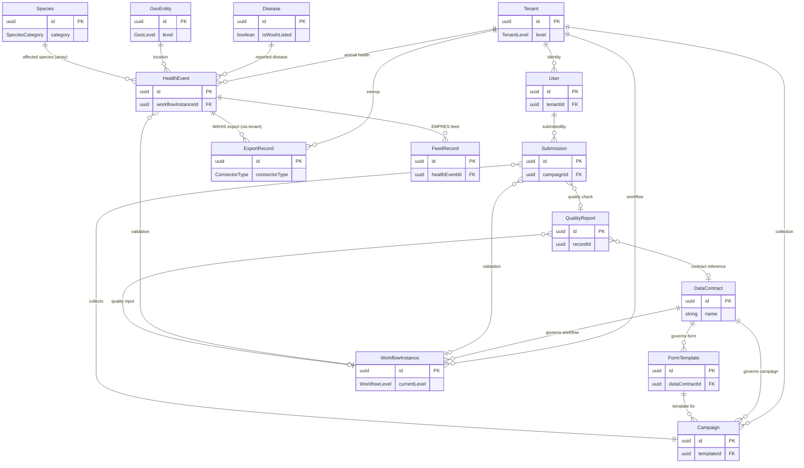

### Cross-Schema Foreign Key Summary

| Source Schema    | Source Model          | Target Schema    | Target Model       | FK Column              |
| ---------------- | --------------------- | ---------------- | ------------------ | ---------------------- |
| `public`         | `User`                | `public`         | `Tenant`           | `tenantId`             |
| `public`         | `Identifier`          | `public`         | `GeoEntity`        | `geoEntityId`          |
| `public`         | `Denominator`         | `public`         | `GeoEntity`        | `geoEntityId`          |
| `public`         | `Denominator`         | `public`         | `Species`          | `speciesId`            |
| `public`         | `Submission`          | `public`         | `QualityReport`    | `qualityReportId`      |
| `public`         | `Campaign`            | `form_builder`   | `FormTemplate`     | `templateId`           |
| `public`         | `Submission`          | `form_builder`   | `FormTemplate`     | `templateId`           |
| `public`         | `Campaign`            | `data_contract`  | `DataContract`     | `dataContractId`       |
| `public`         | `Submission`          | `workflow`        | `WorkflowInstance` | `workflowInstanceId`   |
| `form_builder`   | `FormTemplate`        | `data_contract`  | `DataContract`     | `dataContractId`       |
| `data_contract`  | `ComplianceRecord`    | `public`         | `QualityReport`    | `qualityReportId`      |
| `workflow`        | `WorkflowInstance`    | `data_contract`  | `DataContract`     | `dataContractId`       |
| `workflow`        | `WorkflowInstance`    | `public`         | `QualityReport`    | `qualityReportId`      |
| `animal_health`  | `HealthEvent`         | `public`         | `Disease`          | `diseaseId`            |
| `animal_health`  | `HealthEvent`         | `public`         | `GeoEntity`        | `geoEntityId`          |
| `animal_health`  | `HealthEvent`         | `workflow`        | `WorkflowInstance` | `workflowInstanceId`   |
| `animal_health`  | `LabResult`           | `animal_health`  | `HealthEvent`      | `healthEventId`        |
| `animal_health`  | `LabResult`           | `public`         | `Identifier`       | `labId`                |
| `animal_health`  | `SurveillanceActivity`| `public`         | `Disease`          | `diseaseId`            |
| `animal_health`  | `SurveillanceActivity`| `public`         | `GeoEntity`        | `geoEntityId`          |
| `animal_health`  | `SurveillanceActivity`| `geo_services`   | `MapLayer`         | `mapLayerId`           |
| `animal_health`  | `VaccinationCampaign` | `public`         | `Disease`          | `diseaseId`            |
| `animal_health`  | `VaccinationCampaign` | `public`         | `Species`          | `speciesId`            |
| `animal_health`  | `VaccinationCampaign` | `public`         | `GeoEntity`        | `geoEntityId`          |
| `livestock`      | `LivestockCensus`     | `public`         | `GeoEntity`        | `geoEntityId`          |
| `livestock`      | `LivestockCensus`     | `public`         | `Species`          | `speciesId`            |
| `livestock`      | `SlaughterRecord`     | `public`         | `Identifier`       | `facilityId`           |
| `geo_services`   | `GeoEvent`            | `public`         | `Disease`          | `diseaseId`            |
| `knowledge_hub`  | `Publication`         | `public`         | `FileRecord`       | `fileId`               |
| `knowledge_hub`  | `LearnerProgress`     | `public`         | `User`             | `userId`               |
| `interop_hub`    | `FeedRecord`          | `animal_health`  | `HealthEvent`      | `healthEventId`        |
| `interop_hub`    | `FeedRecord`          | `public`         | `Disease`          | `diseaseId`            |

### Self-Referential Relationships

| Model          | FK Column           | Description                                         |
| -------------- | ------------------- | --------------------------------------------------- |
| `Tenant`       | `parentId`          | Hierarchical: CONTINENTAL -> REC -> MEMBER_STATE    |
| `GeoEntity`    | `parentId`          | Administrative levels: COUNTRY -> ADMIN1 -> ADMIN2 -> ADMIN3 |
| `FormTemplate` | `parentTemplateId`  | Template versioning and inheritance                 |

---

## 18. Multi-Tenant Data Isolation

Every entity that holds domain data includes a `tenantId` column. This is the foundational data
isolation mechanism in ARIS.

### Tenant Scoping Rules

```
Query: SELECT * FROM health_event WHERE tenantId = :userTenantId

  MEMBER_STATE user  --> sees only their country's data
  REC user           --> sees all member states in their REC
  CONTINENTAL user   --> sees everything
```

### Implementation

1. **JWT Extraction:** `@aris/auth-middleware` extracts `tenantId` from the JWT on every request.
2. **Automatic Filtering:** Every Prisma query includes `WHERE tenantId = ?` (enforced at the repository layer).
3. **Parent Visibility:** When a REC or CONTINENTAL user queries, the system expands the tenant filter to include all child tenants using the `Tenant.parentId` hierarchy.
4. **Audit Trail:** `MasterDataAudit.actorTenantId` records which tenant performed each mutation.

### Models WITHOUT tenantId (system-wide)

The following models are system-wide and do not carry a `tenantId`:

| Model              | Reason                                              |
| ------------------ | --------------------------------------------------- |
| `GeoEntity`        | Shared geographic reference data                    |
| `Species`          | Shared taxonomic reference data                     |
| `Disease`          | Shared disease reference data                       |
| `Unit`             | Shared measurement units                            |
| `Temporality`      | Shared calendar definitions (some country-specific via `countryCode`) |
| `Identifier`       | Shared infrastructure registry                      |
| `MapLayer`         | Shared map layer configuration                      |
| `AdminBoundary`    | Shared boundary geometry                            |
| `ConnectorConfig`  | System-wide connector configuration                 |

---

## 19. Indexing Strategy

### Primary Indexes (automatic)

All `id` columns are UUID primary keys with automatic B-tree indexes.

### Tenant Isolation Indexes

Every table with `tenantId` has a composite index:

```sql
CREATE INDEX idx_{table}_tenant ON {table} (tenantId);
CREATE INDEX idx_{table}_tenant_created ON {table} (tenantId, createdAt DESC);
```

### Domain-Specific Indexes

| Table                    | Index                                           | Purpose                          |
| ------------------------ | ----------------------------------------------- | -------------------------------- |
| `health_event`           | `(tenantId, diseaseId, dateOnset)`              | Disease outbreak queries         |
| `health_event`           | `(tenantId, geoEntityId)`                       | Location-based queries           |
| `health_event`           | `(wahisReady) WHERE wahisReady = true`          | WAHIS export filtering           |
| `lab_result`             | `(tenantId, healthEventId)`                     | Lab results by event             |
| `submission`             | `(tenantId, campaignId, status)`                | Campaign progress                |
| `submission`             | `(tenantId, submittedAt DESC)`                  | Recent submissions               |
| `quality_report`         | `(tenantId, overallStatus)`                     | Quality dashboard                |
| `quality_gate_result`    | `(reportId, gate)`                              | Gate-level lookup                |
| `workflow_instance`      | `(tenantId, entityType, status)`                | Workflow queue                   |
| `workflow_transition`    | `(instanceId, createdAt DESC)`                  | Transition history               |
| `notification`           | `(tenantId, userId, status)`                    | User notification inbox          |
| `file_record`            | `(bucket, key) UNIQUE`                          | S3 key uniqueness                |
| `geo_event`              | `GIST (geom)`                                   | Spatial queries (PostGIS)        |
| `admin_boundary`         | `GIST (geom)`                                   | Spatial queries (PostGIS)        |
| `admin_boundary`         | `(countryCode, level)`                          | Boundary hierarchy               |
| `livestock_census`       | `(tenantId, speciesId, year)`                   | Census lookups                   |
| `denominator`            | `(countryCode, speciesId, year, source) UNIQUE` | Denominator uniqueness           |
| `export_record`          | `(tenantId, connectorType, status)`             | Export queue                     |
| `learner_progress`       | `(userId, moduleId) UNIQUE`                     | Learner uniqueness               |
| `master_data_audit`      | `(entityType, entityId, createdAt DESC)`        | Audit history                    |

### PostGIS Spatial Indexes

```sql
CREATE INDEX idx_admin_boundary_geom ON geo_services.admin_boundary USING GIST (geom);
CREATE INDEX idx_geo_event_geom ON geo_services.geo_event USING GIST (geom);
```

---

## 20. Migration and Versioning

### Prisma Migration Strategy

Each microservice manages its own Prisma schema and migration history within its service directory:

```
services/
  animal-health/
    prisma/
      schema.prisma        # Defines animal_health schema models
      migrations/
        20260101000000_init/
        20260115000000_add_confidence_level/
        ...
  master-data/
    prisma/
      schema.prisma        # Defines public schema master data models
      migrations/
        ...
```

### Shared Schema Ownership

| Schema            | Owning Service     | Migration Authority |
| ----------------- | ------------------ | ------------------- |
| `public`          | `master-data` + `credential` + `data-quality` + `collecte` + `message` + `drive` | Split by model ownership |
| `form_builder`    | `form-builder`     | Sole authority      |
| `data_contract`   | `data-contract`    | Sole authority      |
| `workflow`        | `workflow`         | Sole authority      |
| `geo_services`    | `geo-services`     | Sole authority      |
| `animal_health`   | `animal-health`    | Sole authority      |
| `livestock`       | `livestock-prod`   | Sole authority      |
| `knowledge_hub`   | `knowledge-hub`    | Sole authority      |
| `interop_hub`     | `interop-hub`      | Sole authority      |

### Versioning Rules

1. **Schema changes** require a new Prisma migration (never edit existing migrations).
2. **Master data entities** use an `int version` field that increments on each update.
3. **Data contracts** are versioned with `(tenantId, name, version)` uniqueness.
4. **Form templates** are versioned with `(tenantId, name, version)` uniqueness.
5. **Breaking changes** to shared types require a new Kafka topic version (e.g., `v1` -> `v2`).

### Environment Promotion

```
Development (local Docker Compose)
     |
     v
Staging (Kubernetes, Terraform-managed)
     |
     v
Production (Kubernetes, ArgoCD GitOps)
```

Migrations are applied automatically during deployment via Prisma's `prisma migrate deploy` command,
executed as a Kubernetes init container before the service starts.

---

> **Document maintained by:** ARIS Architecture Team
>
> **Last updated:** 2026-02-20
>
> **Related documents:**
> - `docs/architecture/ADR-001-multi-tenant.md` -- Multi-tenancy decision record
> - `docs/architecture/ADR-002-kafka-kraft.md` -- KRaft mode decision record
> - `docs/architecture/ADR-003-quality-gates.md` -- Quality gate specification
> - `CLAUDE.md` -- Global project context and conventions
