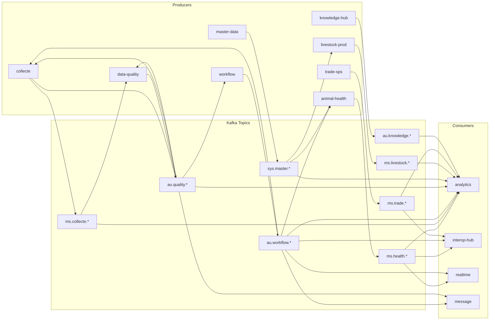

# Kafka Topic Registry

> Complete registry of all Kafka topics in the ARIS 4.0 platform.
> Apache Kafka 3.7 — KRaft mode (no ZooKeeper), 3-broker cluster.

## Naming Convention

```
{scope}.{domain}.{entity}.{action}.v{version}
```

| Segment | Values |
|---------|--------|
| **Scope** | `sys` (system) / `ms` (member state) / `rec` (regional) / `au` (continental) / `dlq` (dead letter) |
| **Domain** | `tenant`, `credential`, `message`, `drive`, `master`, `health`, `collecte`, `formbuilder`, `workflow`, `quality`, `livestock`, `trade`, `knowledge`, `interop` |
| **Entity** | Domain-specific entity name (e.g., `outbreak`, `form`, `record`) |
| **Action** | `created`, `updated`, `deleted`, `confirmed`, `validated`, `rejected`, `submitted`, `approved`, `escalated`, `ready`, `synced`, `exported`, `overdue`, `failed` |
| **Version** | Starts at `v1`; bumped on breaking schema changes |

## Cluster Configuration

| Setting | Value |
|---------|-------|
| Brokers | 3 (kafka-1:9092, kafka-2:9094, kafka-3:9096) |
| Replication factor | 3 |
| Min ISR | 2 |
| Auto topic creation | Disabled |
| Default partitions | 3 |
| Retention | 7 days (168 hours) |

---

## System Topics (7)

| Constant | Topic | Producer | Consumers | Schema |
|----------|-------|----------|-----------|--------|
| `TOPIC_SYS_TENANT_CREATED` | `sys.tenant.created.v1` | tenant | credential, message | `{ id, name, code, level, parentId, countryCode }` |
| `TOPIC_SYS_TENANT_UPDATED` | `sys.tenant.updated.v1` | tenant | credential, message | `{ id, name, code, level, isActive }` |
| `TOPIC_SYS_CREDENTIAL_USER_CREATED` | `sys.credential.user.created.v1` | credential | message, realtime | `{ userId, email, role, tenantId }` |
| `TOPIC_SYS_CREDENTIAL_USER_AUTHENTICATED` | `sys.credential.user.authenticated.v1` | credential | analytics, realtime | `{ userId, email, role, tenantId, loginAt }` |
| `TOPIC_SYS_MESSAGE_NOTIFICATION_SENT` | `sys.message.notification.sent.v1` | message | analytics | `{ notificationId, channel, userId, subject }` |
| `TOPIC_SYS_MESSAGE_NOTIFICATION_FAILED` | `sys.message.notification.failed.v1` | message | analytics | `{ notificationId, channel, userId, failReason }` |
| `TOPIC_SYS_DRIVE_FILE_UPLOADED` | `sys.drive.file.uploaded.v1` | drive | analytics | `{ fileId, bucket, key, mimeType, size, uploadedBy }` |

## Master Data Topics (4)

| Constant | Topic | Producer | Consumers | Schema |
|----------|-------|----------|-----------|--------|
| `TOPIC_SYS_MASTER_GEO_UPDATED` | `sys.master.geo.updated.v1` | master-data | all domain services, geo-services | `{ id, code, name, level, parentId }` |
| `TOPIC_SYS_MASTER_SPECIES_UPDATED` | `sys.master.species.updated.v1` | master-data | animal-health, livestock-prod, fisheries | `{ id, code, scientificName, category }` |
| `TOPIC_SYS_MASTER_DISEASE_UPDATED` | `sys.master.disease.updated.v1` | master-data | animal-health, analytics | `{ id, code, nameEn, isWoahListed, isNotifiable }` |
| `TOPIC_SYS_MASTER_DENOMINATOR_UPDATED` | `sys.master.denominator.updated.v1` | master-data | analytics, interop-hub | `{ id, countryCode, speciesId, year, source, population }` |

## Quality Topics (4)

| Constant | Topic | Producer | Consumers | Schema |
|----------|-------|----------|-----------|--------|
| `TOPIC_AU_QUALITY_VALIDATION_REQUESTED` | `au.quality.validation.requested.v1` | collecte | data-quality | `{ recordId, entityType, domain, record, ...gateConfig }` |
| `TOPIC_AU_QUALITY_RECORD_VALIDATED` | `au.quality.record.validated.v1` | data-quality | workflow, analytics, collecte | `{ reportId, recordId, entityType, domain, overallStatus }` |
| `TOPIC_AU_QUALITY_RECORD_REJECTED` | `au.quality.record.rejected.v1` | data-quality | message, analytics, collecte | `{ reportId, recordId, entityType, domain, overallStatus, violations[] }` |
| `TOPIC_AU_QUALITY_CORRECTION_OVERDUE` | `au.quality.correction.overdue.v1` | data-quality | message, workflow | `{ reportId, recordId, deadline, daysOverdue }` |

## Collecte Topics (5)

| Constant | Topic | Producer | Consumers | Schema |
|----------|-------|----------|-----------|--------|
| `TOPIC_MS_COLLECTE_CAMPAIGN_CREATED` | `ms.collecte.campaign.created.v1` | collecte | analytics, message | `{ campaignId, name, domain, status, targetSubmissions }` |
| `TOPIC_MS_COLLECTE_FORM_SUBMITTED` | `ms.collecte.form.submitted.v1` | collecte | analytics, data-quality | `{ submissionId, campaignId, templateId, submittedBy, domain }` |
| `TOPIC_MS_COLLECTE_FORM_SYNCED` | `ms.collecte.form.synced.v1` | collecte | analytics | `{ deviceId, acceptedCount, rejectedCount, conflictCount }` |
| `TOPIC_MS_COLLECTE_SUBMISSION_QUALITY_COMPLETED` | `ms.collecte.submission.quality-completed.v1` | data-quality | collecte | `{ submissionId, reportId, overallStatus, domain }` |
| `TOPIC_MS_COLLECTE_SUBMISSION_WORKFLOW_CREATED` | `ms.collecte.submission.workflow-created.v1` | workflow | collecte | `{ submissionId, workflowInstanceId, domain }` |

## Form Builder Topics (2)

| Constant | Topic | Producer | Consumers | Schema |
|----------|-------|----------|-----------|--------|
| `TOPIC_MS_FORMBUILDER_TEMPLATE_CREATED` | `ms.formbuilder.template.created.v1` | form-builder | collecte | `{ templateId, name, domain, version }` |
| `TOPIC_MS_FORMBUILDER_TEMPLATE_PUBLISHED` | `ms.formbuilder.template.published.v1` | form-builder | collecte, message | `{ templateId, name, domain, version, publishedAt }` |

## Workflow Topics (8)

| Constant | Topic | Producer | Consumers | Schema |
|----------|-------|----------|-----------|--------|
| `TOPIC_AU_WORKFLOW_INSTANCE_REQUESTED` | `au.workflow.instance.requested.v1` | collecte | workflow | `{ entityType, entityId, domain, qualityReportId?, dataContractId? }` |
| `TOPIC_AU_WORKFLOW_INSTANCE_CREATED` | `au.workflow.instance.created.v1` | workflow | collecte | `{ instanceId, entityType, entityId, domain, currentLevel, status }` |
| `TOPIC_AU_WORKFLOW_VALIDATION_SUBMITTED` | `au.workflow.validation.submitted.v1` | workflow | analytics, message | `{ instanceId, entityType, entityId, domain, level }` |
| `TOPIC_AU_WORKFLOW_VALIDATION_APPROVED` | `au.workflow.validation.approved.v1` | workflow | analytics, message, realtime | `{ instanceId, entityType, entityId, fromLevel, toLevel }` |
| `TOPIC_AU_WORKFLOW_VALIDATION_REJECTED` | `au.workflow.validation.rejected.v1` | workflow | analytics, message | `{ instanceId, entityType, entityId, level, reason }` |
| `TOPIC_AU_WORKFLOW_VALIDATION_ESCALATED` | `au.workflow.validation.escalated.v1` | workflow | message, analytics | `{ instanceId, entityType, entityId, fromLevel, toLevel, reason }` |
| `TOPIC_AU_WORKFLOW_WAHIS_READY` | `au.workflow.wahis.ready.v1` | workflow | interop-hub, message, animal-health | `{ instanceId, entityType, entityId, domain, flag }` |
| `TOPIC_AU_WORKFLOW_ANALYTICS_READY` | `au.workflow.analytics.ready.v1` | workflow | analytics, animal-health | `{ instanceId, entityType, entityId, domain, flag }` |

## Animal Health Topics (8)

| Constant | Topic | Producer | Consumers | Schema |
|----------|-------|----------|-----------|--------|
| `TOPIC_MS_HEALTH_EVENT_CREATED` | `ms.health.event.created.v1` | animal-health | analytics, realtime, geo-services | `{ eventId, diseaseId, eventType, geoEntityId, cases, deaths }` |
| `TOPIC_MS_HEALTH_EVENT_UPDATED` | `ms.health.event.updated.v1` | animal-health | analytics, realtime | `{ eventId, diseaseId, eventType, cases, deaths }` |
| `TOPIC_MS_HEALTH_EVENT_CONFIRMED` | `ms.health.event.confirmed.v1` | animal-health | analytics, interop-hub, message | `{ eventId, diseaseId, dateConfirmation, confidenceLevel }` |
| `TOPIC_MS_HEALTH_LAB_RESULT_CREATED` | `ms.health.lab.result.created.v1` | animal-health | analytics | `{ labResultId, sampleType, testType, result, healthEventId }` |
| `TOPIC_MS_HEALTH_VACCINATION_COMPLETED` | `ms.health.vaccination.completed.v1` | animal-health | analytics | `{ campaignId, diseaseId, speciesId, dosesUsed, coverageEstimate }` |
| `TOPIC_MS_HEALTH_SURVEILLANCE_REPORTED` | `ms.health.surveillance.reported.v1` | animal-health | analytics | `{ activityId, type, diseaseId, sampleSize, positivityRate }` |
| `TOPIC_REC_HEALTH_OUTBREAK_ALERT` | `rec.health.outbreak.alert.v1` | animal-health | message, realtime, interop-hub | `{ eventId, diseaseId, countryCode, severity }` |
| `TOPIC_MS_HEALTH_ENTITY_FLAGS_UPDATED` | `ms.health.entity.flags-updated.v1` | animal-health | analytics | `{ entityType, entityId, wahisReady?, analyticsReady? }` |

## Livestock Topics (8)

> Defined locally in `services/livestock-prod/src/kafka-topics.ts` (pending migration to shared-types).

| Constant | Topic | Producer | Consumers | Schema |
|----------|-------|----------|-----------|--------|
| `TOPIC_MS_LIVESTOCK_CENSUS_CREATED` | `ms.livestock.census.created.v1` | livestock-prod | analytics | `{ censusId, geoEntityId, speciesId, year, population }` |
| `TOPIC_MS_LIVESTOCK_CENSUS_UPDATED` | `ms.livestock.census.updated.v1` | livestock-prod | analytics | `{ censusId, geoEntityId, speciesId, year, population }` |
| `TOPIC_MS_LIVESTOCK_PRODUCTION_RECORDED` | `ms.livestock.production.recorded.v1` | livestock-prod | analytics | `{ recordId, speciesId, productType, quantity, unit }` |
| `TOPIC_MS_LIVESTOCK_PRODUCTION_UPDATED` | `ms.livestock.production.updated.v1` | livestock-prod | analytics | `{ recordId, speciesId, productType, quantity, unit }` |
| `TOPIC_MS_LIVESTOCK_SLAUGHTER_RECORDED` | `ms.livestock.slaughter.recorded.v1` | livestock-prod | analytics | `{ recordId, speciesId, facilityId, count }` |
| `TOPIC_MS_LIVESTOCK_SLAUGHTER_UPDATED` | `ms.livestock.slaughter.updated.v1` | livestock-prod | analytics | `{ recordId, speciesId, facilityId, count }` |
| `TOPIC_MS_LIVESTOCK_TRANSHUMANCE_CREATED` | `ms.livestock.transhumance.created.v1` | livestock-prod | analytics, geo-services | `{ corridorId, name, speciesId, seasonality, crossBorder }` |
| `TOPIC_MS_LIVESTOCK_TRANSHUMANCE_UPDATED` | `ms.livestock.transhumance.updated.v1` | livestock-prod | analytics, geo-services | `{ corridorId, name, speciesId, seasonality, crossBorder }` |

## Trade & SPS Topics (6)

> Defined locally in `services/trade-sps/src/kafka-topics.ts` (pending migration to shared-types).

| Constant | Topic | Producer | Consumers | Schema |
|----------|-------|----------|-----------|--------|
| `TOPIC_MS_TRADE_FLOW_CREATED` | `ms.trade.flow.created.v1` | trade-sps | analytics | `{ flowId, speciesId, origin, destination, quantity, value }` |
| `TOPIC_MS_TRADE_FLOW_UPDATED` | `ms.trade.flow.updated.v1` | trade-sps | analytics | `{ flowId, speciesId, origin, destination, quantity, value }` |
| `TOPIC_MS_TRADE_SPS_CERTIFIED` | `ms.trade.sps.certified.v1` | trade-sps | analytics, interop-hub | `{ certificateId, speciesId, destination, issuedAt }` |
| `TOPIC_MS_TRADE_SPS_UPDATED` | `ms.trade.sps.updated.v1` | trade-sps | analytics | `{ certificateId, speciesId, status }` |
| `TOPIC_MS_TRADE_PRICE_RECORDED` | `ms.trade.price.recorded.v1` | trade-sps | analytics | `{ priceId, speciesId, marketId, pricePerUnit, unit }` |
| `TOPIC_MS_TRADE_PRICE_UPDATED` | `ms.trade.price.updated.v1` | trade-sps | analytics | `{ priceId, speciesId, marketId, pricePerUnit, unit }` |

## Knowledge Hub Topics (7)

| Constant | Topic | Producer | Consumers | Schema |
|----------|-------|----------|-----------|--------|
| `TOPIC_AU_KNOWLEDGE_PUBLICATION_CREATED` | `au.knowledge.publication.created.v1` | knowledge-hub | analytics | `{ publicationId, title, domain, type }` |
| `TOPIC_AU_KNOWLEDGE_PUBLICATION_UPDATED` | `au.knowledge.publication.updated.v1` | knowledge-hub | analytics | `{ publicationId, title, domain, type }` |
| `TOPIC_AU_KNOWLEDGE_PUBLICATION_DELETED` | `au.knowledge.publication.deleted.v1` | knowledge-hub | analytics | `{ publicationId }` |
| `TOPIC_AU_KNOWLEDGE_ELEARNING_CREATED` | `au.knowledge.elearning.created.v1` | knowledge-hub | analytics | `{ moduleId, title, domain }` |
| `TOPIC_AU_KNOWLEDGE_ELEARNING_UPDATED` | `au.knowledge.elearning.updated.v1` | knowledge-hub | analytics | `{ moduleId, title, domain }` |
| `TOPIC_AU_KNOWLEDGE_FAQ_CREATED` | `au.knowledge.faq.created.v1` | knowledge-hub | analytics | `{ faqId, domain, language }` |
| `TOPIC_AU_KNOWLEDGE_FAQ_UPDATED` | `au.knowledge.faq.updated.v1` | knowledge-hub | analytics | `{ faqId, domain, language }` |

## Interop Topics (3)

| Constant | Topic | Producer | Consumers | Schema |
|----------|-------|----------|-----------|--------|
| `TOPIC_AU_INTEROP_WAHIS_EXPORTED` | `au.interop.wahis.exported.v1` | interop-hub | analytics, message | `{ exportId, countryCode, period, recordCount, format }` |
| `TOPIC_AU_INTEROP_EMPRES_FED` | `au.interop.empres.fed.v1` | interop-hub | analytics | `{ feedId, healthEventId, diseaseId, confidenceLevel }` |
| `TOPIC_AU_INTEROP_FAOSTAT_SYNCED` | `au.interop.faostat.synced.v1` | interop-hub | analytics, master-data | `{ syncId, countryCode, year, recordsImported, discrepancies }` |

## Dead Letter Queues (4)

| Constant | Topic | Purpose |
|----------|-------|---------|
| `TOPIC_DLQ_ALL` | `dlq.all.v1` | Catch-all DLQ for unhandled failures |
| `TOPIC_DLQ_HEALTH` | `dlq.health.v1` | Health domain processing failures |
| `TOPIC_DLQ_COLLECTE` | `dlq.collecte.v1` | Collecte domain processing failures |
| `TOPIC_DLQ_WORKFLOW` | `dlq.workflow.v1` | Workflow domain processing failures |

---

## Kafka Headers (Standard)

Every message includes these headers (via `KafkaHeaders` type from `@aris/shared-types`):

```typescript
interface KafkaHeaders {
  correlationId: string;      // UUID for request tracing
  sourceService: string;      // e.g., "animal-health-service"
  tenantId: string;           // Tenant UUID
  userId?: string;            // Actor who triggered the event
  schemaVersion: string;      // e.g., "1"
  timestamp: string;          // ISO 8601
}
```

## Topic Flow Diagram



### Event-Driven Inter-Service Communication

All inter-service communication uses Kafka events (no synchronous REST calls between services):

```
collecte ──→ au.quality.validation.requested.v1 ──→ data-quality
data-quality ──→ au.quality.record.validated.v1 ──→ collecte, workflow
collecte ──→ au.workflow.instance.requested.v1 ──→ workflow
workflow ──→ au.workflow.instance.created.v1 ──→ collecte
workflow ──→ au.workflow.wahis.ready.v1 ──→ animal-health, interop-hub
workflow ──→ au.workflow.analytics.ready.v1 ──→ animal-health, analytics
```

## Summary

| Category | Count |
|----------|-------|
| Central registry topics | 52 |
| Local domain topics | 14 |
| **Total topics** | **66** |
| Publisher services | 10+ |
| Consumer services | 10+ |
| DLQ topics | 4 |
| Inter-service event chains | 3 (all async, zero REST) |
