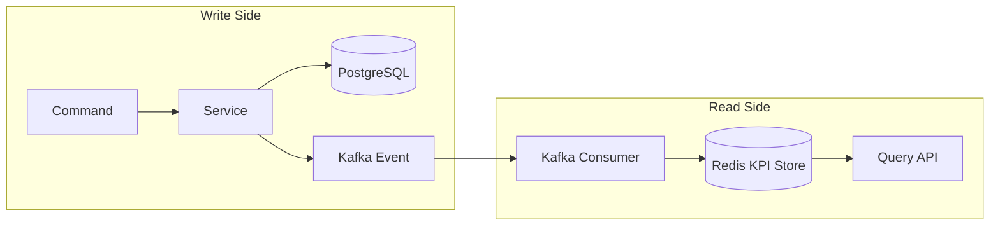
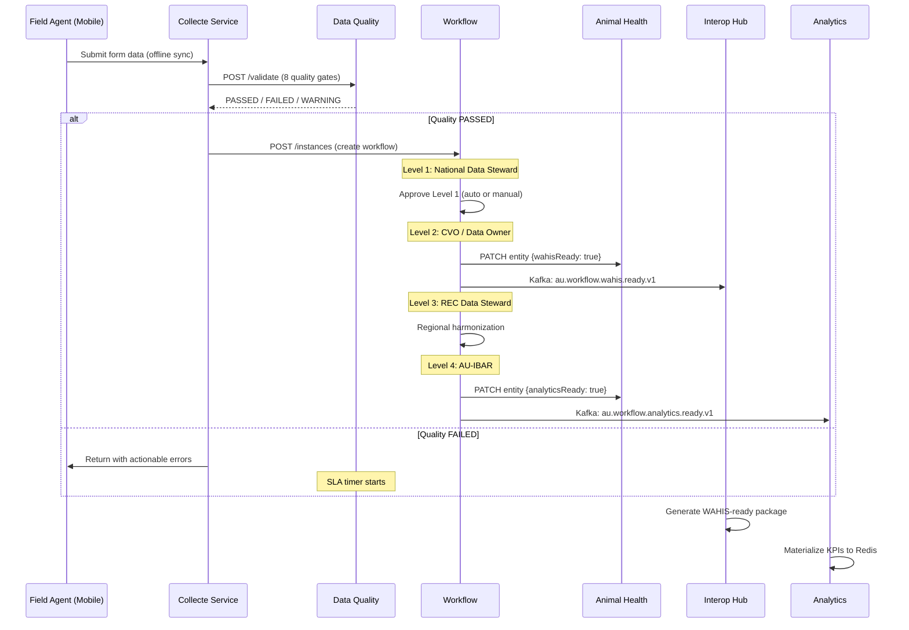

# ARIS 3.0 — System Architecture Overview

> Animal Resources Information System
> AU-IBAR Continental Digital Infrastructure

## 1. Vision

ARIS 3.0 is the **digital backbone** of the African Union's Inter-African Bureau for Animal Resources (AU-IBAR). It is a federated System-of-Systems covering all animal resources across **55 Member States** and **8 Regional Economic Communities (RECs)**.

**Aligned with:** AU Agenda 2063, LiDeSA, PFRS, AU Digital Transformation Strategy 2020-2030.

## 2. Architecture Style

ARIS follows a **microservices architecture** with event-driven communication via Apache Kafka. The system employs **CQRS** (Command Query Responsibility Segregation) with Redis read models for high-performance dashboards, and maintains a full **audit trail** of every mutation.

```mermaid
graph TB
    subgraph "Frontend Layer"
        WEB[Next.js 14 Web App]
        ADMIN[Admin Panel]
        MOBILE[Kotlin Android App<br/>Offline-First]
    end

    subgraph "API Gateway Layer"
        AUTH[Auth Middleware<br/>JWT RS256 + RBAC]
    end

    subgraph "Platform Services"
        TENANT[Tenant :3001]
        CRED[Credential :3002]
        MSG[Message :3006]
        DRIVE[Drive :3007]
        RT[Realtime :3008]
    end

    subgraph "Data Hub Services"
        MD[Master Data :3003]
        DQ[Data Quality :3004]
        DC[Data Contract :3005]
        INTEROP[Interop Hub :3032]
    end

    subgraph "Collecte & Workflow"
        FB[Form Builder :3010]
        COL[Collecte :3011]
        WF[Workflow :3012]
    end

    subgraph "Domain Services"
        AH[Animal Health :3020]
        LP[Livestock Prod :3021]
        FISH[Fisheries :3022]
        WILD[Wildlife :3023]
        API_BEE[Apiculture :3024]
        TRADE[Trade & SPS :3025]
        GOV[Governance :3026]
        CLIM[Climate & Env :3027]
    end

    subgraph "Data & Integration"
        ANALYTICS[Analytics :3030]
        GEO[Geo Services :3031]
        KH[Knowledge Hub :3033]
    end

    subgraph "Infrastructure"
        KAFKA[Apache Kafka 3.7<br/>KRaft Mode]
        PG[(PostgreSQL 16<br/>+ PostGIS 3.4)]
        REDIS[(Redis 7)]
        ES[(Elasticsearch 8)]
        MINIO[(MinIO<br/>S3-Compatible)]
    end

    WEB & ADMIN & MOBILE --> AUTH
    AUTH --> TENANT & CRED & MSG & DRIVE & RT
    AUTH --> MD & DQ & DC & INTEROP
    AUTH --> FB & COL & WF
    AUTH --> AH & LP & FISH & WILD & API_BEE & TRADE & GOV & CLIM
    AUTH --> ANALYTICS & GEO & KH

    TENANT & CRED & MD & DQ & DC & COL & WF & AH & LP --> KAFKA
    KAFKA --> ANALYTICS & INTEROP & RT & WF
    TENANT & CRED & MD & DQ & DC & COL & WF & AH & LP & FISH --> PG
    ANALYTICS --> REDIS
    KH & MD --> ES
    DRIVE --> MINIO
```



## 3. Service Inventory (22 Microservices)

### Platform Services (CC-1)

| Service | Port | Purpose |
|---------|------|---------|
| **tenant** | 3001 | Multi-tenant hierarchy (AU → REC → Member State) |
| **credential** | 3002 | Auth JWT RS256, RBAC, MFA, rate limiting |
| **message** | 3006 | Notifications (SMS, email, push, in-app) |
| **drive** | 3007 | Document storage via MinIO (S3-compatible) |
| **realtime** | 3008 | WebSocket sync for live updates |

### Data Hub Services (CC-2)

| Service | Port | Purpose |
|---------|------|---------|
| **master-data** | 3003 | Dictionary: geography, species, diseases, units, identifiers |
| **data-quality** | 3004 | 8 quality gates, confidence scoring, correction loop |
| **data-contract** | 3005 | Contract registry, schema enforcement, SLA tracking |
| **interop-hub** | 3032 | WAHIS/EMPRES/FAOSTAT/FishStatJ/CITES connectors |

### Collecte & Workflow Services (CC-3)

| Service | Port | Purpose |
|---------|------|---------|
| **form-builder** | 3010 | No-code form builder (JSON Schema) |
| **collecte** | 3011 | Campaign orchestration, offline sync |
| **workflow** | 3012 | 4-level validation engine (Annex B &sect;B4.1) |

### Domain Services (CC-4)

| Service | Port | Purpose |
|---------|------|---------|
| **animal-health** | 3020 | Outbreaks, surveillance, lab results, vaccination, AMR |
| **livestock-prod** | 3021 | Census, production systems, slaughter, transhumance |
| **fisheries** | 3022 | Captures, fleet, licenses, aquaculture, aquatic health |
| **wildlife** | 3023 | Inventories, protected areas, CITES, human-wildlife conflict |
| **apiculture** | 3024 | Apiaries, honey production, colony health |
| **trade-sps** | 3025 | Trade flows, SPS certification, market intelligence |
| **governance** | 3026 | Legal frameworks, veterinary capacities, PVS metrics |
| **climate-env** | 3027 | Water stress, rangelands, GHG, vulnerability hotspots |

### Data & Integration Services (CC-4)

| Service | Port | Purpose |
|---------|------|---------|
| **analytics** | 3030 | Kafka Streams, KPIs, denominators, CSV export |
| **geo-services** | 3031 | PostGIS, pg_tileserv, risk layers, spatial queries |
| **knowledge-hub** | 3033 | Portal, e-repository, e-learning, FAQs |

## 4. Tech Stack

| Layer | Technology | Version |
|-------|-----------|---------|
| Runtime | Node.js | 20 LTS |
| Backend | NestJS + TypeScript (strict) | 10 / 5 |
| Frontend | Next.js + Shadcn/UI + Tailwind CSS | 14 |
| Mobile | Kotlin + Jetpack Compose + Room | Latest |
| ORM | Prisma (multi-schema, type-safe) | 5 |
| Message Broker | Apache Kafka (KRaft, no ZooKeeper) | 3.7 |
| Database | PostgreSQL + PostGIS | 16 / 3.4 |
| Cache | Redis | 7 |
| Search | Elasticsearch | 8 |
| Object Storage | MinIO (S3-compatible) | Latest |
| Auth | Custom JWT RS256 + bcrypt | - |
| Monitoring | Prometheus + Grafana + Loki | - |
| Infra | Docker + Kubernetes + Terraform | - |
| CI/CD | GitHub Actions + ArgoCD | - |
| Tests | Vitest + Testcontainers | 1.6 |
| Monorepo | Turborepo + pnpm workspaces | 2.0 |

## 5. Architecture Principles

1. **Federated Subsidiarity** — Data produced and validated at country level. ARIS consolidates at REC and continental levels.
2. **Report Once, Use Many** — Single entry at country level feeds WAHIS, EMPRES, FAOSTAT, dashboards, and CAADP.
3. **Interoperability by Design** — Master data referentials, data contracts, and audit trails are first-class citizens.
4. **Official vs Analytical Distinction** — WAHIS notifications represent national sovereignty. Dashboards carry provenance and disclaimers.
5. **Production-Grade from Day 1** — HA/DR, RBAC, MFA, audit trail, backups, firewalls, incident response.

## 6. Communication Patterns

### Synchronous (HTTP REST)

- Client-to-service via REST APIs (`/api/v1/...`)
- Inter-service calls via `@aris/service-clients` (retry, circuit breaker, timeout)
- Tenant header forwarding (`x-tenant-id`) on every request

### Asynchronous (Kafka Events)

- Domain events published after every state mutation
- Topic naming: `{scope}.{domain}.{entity}.{action}.v{version}`
- Consumer groups per service for independent scaling
- Dead Letter Queues (DLQ) for failed message processing

### CQRS Pattern

- **Write side**: NestJS services write to PostgreSQL via Prisma
- **Read side**: Analytics service materializes KPIs into Redis
- **Sync**: Kafka events bridge write and read models



## 7. 9 Business Domains

| # | Domain | Scope |
|---|--------|-------|
| 1 | Governance & Capacities | Legal frameworks, veterinary services, PVS metrics |
| 2 | Animal Health & One Health | Surveillance, outbreaks, lab, vaccination, AMR |
| 3 | Production & Pastoralism | Census, production systems, transhumance corridors |
| 4 | Trade, Markets & SPS | Trade flows, SPS certification, market intelligence (AfCFTA) |
| 5 | Fisheries & Aquaculture | Captures, fleet, licenses, aquaculture, aquatic health |
| 6 | Wildlife & Biodiversity | Inventories, protected areas, CITES, human-wildlife conflict |
| 7 | Apiculture & Pollination | Apiaries, honey production, colony health |
| 8 | Climate & Environment | Water stress, rangelands, GHG, vulnerability hotspots |
| 9 | Knowledge Management | Portal, e-repository, e-learning, briefs, MEL |

## 8. Data Flow — End to End



## 9. Monorepo Structure

```
aris/
├── packages/              # Shared libraries
│   ├── shared-types/      # TS types, DTOs, Kafka contracts, enums
│   ├── kafka-client/      # Generic Kafka producer/consumer + DLQ
│   ├── auth-middleware/    # JWT RS256 validation + RBAC + tenant extraction
│   ├── service-clients/   # Inter-service HTTP clients (retry, circuit breaker)
│   ├── db-schemas/        # Prisma schemas + migrations (one per service)
│   ├── ui-components/     # Design System React (Shadcn + Tailwind)
│   ├── quality-rules/     # Shared data quality gate definitions
│   └── test-utils/        # Factories, Testcontainers helpers
│
├── services/              # 22 NestJS microservices
├── apps/                  # Frontend applications (web, admin, mobile)
├── infra/                 # Terraform, K8s, Helm
└── docs/                  # Architecture, ADRs, runbooks
```

## 10. Development Team — 6 Claude Code Instances

| ID | Name | Scope |
|----|------|-------|
| CC-1 | Platform Core | tenant, credential, message, drive, realtime + ALL packages/ |
| CC-2 | Data Hub | master-data, data-quality, data-contract, interop-hub |
| CC-3 | Collecte & Workflow | form-builder, collecte, workflow |
| CC-4 | Domain Services | animal-health, livestock-prod, fisheries, wildlife, apiculture, trade-sps, governance, climate-env + analytics, geo-services, knowledge-hub |
| CC-5 | Frontend Web | apps/web, apps/admin, packages/ui-components |
| CC-6 | Mobile Kotlin | apps/mobile (Kotlin, Jetpack Compose, Room, offline-first) |

**File Ownership Rule**: Each file has ONE owner. Other instances read only. Conflicts resolved by human architect.
