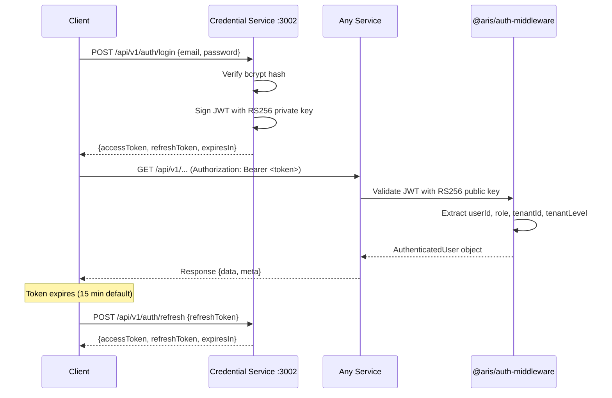
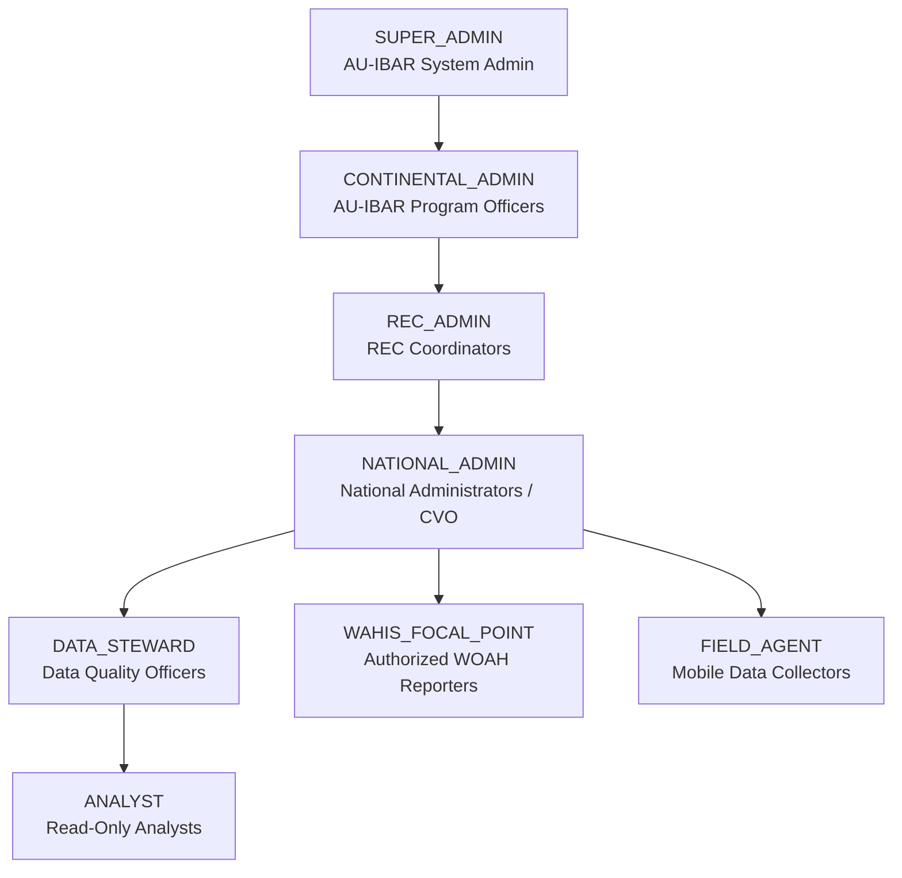

# Security Architecture

> Authentication, authorization, data classification, and encryption for ARIS 3.0.

## 1. Authentication Flow

### JWT RS256 Token Flow

ARIS uses **custom JWT RS256** authentication (no external IdP dependency) via the credential service.



### Token Structure

```json
{
  "sub": "user-uuid",
  "email": "user@ke.gov",
  "role": "DATA_STEWARD",
  "tenantId": "tenant-uuid",
  "tenantLevel": "MEMBER_STATE",
  "iat": 1700000000,
  "exp": 1700000900,
  "iss": "aris-credential-service"
}
```

### Key Management

| Item | Details |
|------|---------|
| Algorithm | RS256 (RSA + SHA-256) |
| Key size | 2048-bit minimum |
| Private key | `JWT_PRIVATE_KEY_PATH` — used by credential service only |
| Public key | `JWT_PUBLIC_KEY_PATH` — distributed to all services |
| Access token TTL | 15 minutes (`JWT_ACCESS_EXPIRES_IN`) |
| Refresh token TTL | 7 days (`JWT_REFRESH_EXPIRES_IN`) |
| Key rotation | Manual; update key pair, restart services |

### Password Security

| Item | Details |
|------|---------|
| Hashing | bcrypt with salt rounds = 12 |
| MFA | TOTP-based (mfaEnabled, mfaSecret on User model) |
| Rate limiting | Per-IP and per-user on login endpoint |

## 2. RBAC — Role-Based Access Control

### 8 Roles



| Role | Level | Permissions |
|------|-------|------------|
| `SUPER_ADMIN` | Continental | Full system access, user management, configuration |
| `CONTINENTAL_ADMIN` | Continental | All data read/write, contract management, interop |
| `REC_ADMIN` | REC | REC + child Member State data, workflow L3 |
| `NATIONAL_ADMIN` | Member State | National data CRUD, user management, workflow L2 |
| `DATA_STEWARD` | Member State/REC | Quality validation, correction, workflow L1/L3 |
| `WAHIS_FOCAL_POINT` | Member State | WAHIS export, SPS certification |
| `ANALYST` | Any | Read-only access to published/analytical data |
| `FIELD_AGENT` | Member State | Mobile data submission, offline sync |

### Workflow RBAC Mapping

| Workflow Level | Authorized Roles |
|---------------|-----------------|
| NATIONAL_TECHNICAL (L1) | DATA_STEWARD, NATIONAL_ADMIN |
| NATIONAL_OFFICIAL (L2) | NATIONAL_ADMIN, WAHIS_FOCAL_POINT |
| REC_HARMONIZATION (L3) | REC_ADMIN, DATA_STEWARD |
| CONTINENTAL_PUBLICATION (L4) | CONTINENTAL_ADMIN, SUPER_ADMIN |

### Auth Guards (NestJS)

Every protected endpoint uses three guards from `@aris/auth-middleware`:

```typescript
@UseGuards(AuthGuard)      // Validates JWT, extracts user
@UseGuards(TenantGuard)    // Enforces tenant isolation
@UseGuards(RolesGuard)     // Checks role against @Roles() decorator
@Roles(UserRole.NATIONAL_ADMIN, UserRole.DATA_STEWARD)
```

## 3. Multi-Tenant Isolation

### Tenant Hierarchy

```
AU-IBAR (CONTINENTAL)
  ├── IGAD (REC)
  │   ├── Kenya (MEMBER_STATE)
  │   ├── Ethiopia (MEMBER_STATE)
  │   └── ...
  ├── ECOWAS (REC)
  │   ├── Nigeria (MEMBER_STATE)
  │   └── ...
  └── ... (8 RECs total)
```

### Isolation Rules

| User Level | Data Access |
|-----------|-------------|
| CONTINENTAL | All tenants (read everything) |
| REC | Own tenant + child Member State tenants |
| MEMBER_STATE | Own tenant only |

### Implementation

- Every DB query includes `WHERE tenant_id = ?`
- `tenantId` extracted from JWT by `TenantGuard`
- Parent-child resolution via tenant service
- Inter-service calls forward `x-tenant-id` header

## 4. Data Classification

### 4 Levels (Annex B &sect;B6)

| Level | Description | Access |
|-------|-------------|--------|
| `PUBLIC` | Open data, aggregated stats | All authenticated users |
| `PARTNER` | Shared with authorized orgs (WOAH, FAO) | ANALYST+ with partner agreements |
| `RESTRICTED` | Individual outbreak data, unconfirmed reports | DATA_STEWARD+, same tenant |
| `CONFIDENTIAL` | Credentials, security configs, national security | SUPER_ADMIN, NATIONAL_ADMIN only |

### Rules

- Classification is **inherited** by derived products (e.g., a dashboard from RESTRICTED data is RESTRICTED)
- Every entity has a `dataClassification` field
- Audit trail entries record the classification level
- Export packages respect classification (WAHIS exports only PARTNER+ data)

## 5. Kafka Security

### ACL Configuration

| Principal | Topic Pattern | Operations |
|-----------|--------------|------------|
| `animal-health-service` | `ms.health.*` | WRITE |
| `analytics-service` | `ms.health.*`, `au.workflow.*`, `ms.collecte.*` | READ |
| `workflow-service` | `au.workflow.*` | WRITE |
| `workflow-service` | `au.quality.*` | READ |
| `interop-hub-service` | `au.interop.*` | WRITE |
| `interop-hub-service` | `au.workflow.wahis.ready.*` | READ |
| `data-quality-service` | `au.quality.*` | WRITE |
| `collecte-service` | `ms.collecte.*` | WRITE |

### Message Security

- All Kafka messages include `tenantId` in headers
- Consumer services validate `tenantId` matches expected scope
- DLQ topics capture failed messages for manual review
- No PII in topic keys (use entity UUIDs only)

## 6. Encryption

### At Rest

| Component | Encryption |
|-----------|-----------|
| PostgreSQL | Filesystem-level encryption (LUKS/dm-crypt) |
| Redis | No built-in encryption (use network-level isolation) |
| MinIO | Server-side encryption (SSE-S3) |
| Elasticsearch | Filesystem-level encryption |
| JWT private keys | File permissions (600), stored outside repo |

### In Transit

| Component | Encryption |
|-----------|-----------|
| Client ↔ API | TLS 1.3 (HTTPS) |
| Service ↔ PostgreSQL | SSL mode = `require` |
| Service ↔ Redis | TLS (optional, recommended for production) |
| Service ↔ Kafka | SASL_SSL (production) / PLAINTEXT (dev) |
| Service ↔ MinIO | TLS |

## 7. Audit Trail

Every mutation is logged with:

```typescript
interface AuditEntry {
  id: string;
  entityType: string;          // e.g., "HealthEvent", "User"
  entityId: string;
  action: 'CREATE' | 'UPDATE' | 'DELETE' | 'VALIDATE' | 'REJECT' | 'EXPORT';
  actor: {
    userId: string;
    role: UserRole;
    tenantId: string;
  };
  timestamp: Date;
  reason?: string;             // Required for DELETE, REJECT
  previousVersion?: object;    // Snapshot before change
  newVersion?: object;         // Snapshot after change
  dataClassification: DataClassification;
}
```

### Storage

- Master data audit: `MasterDataAudit` table in PostgreSQL
- Domain service audit: Kafka events (retained for compliance)
- Shared audit table: `audit.audit_log` with indexes on entity, actor, tenant, timestamp

## 8. Security Checklist

- [x] JWT RS256 asymmetric key authentication
- [x] bcrypt password hashing (12 salt rounds)
- [x] RBAC with 8 roles and per-endpoint guards
- [x] Multi-tenant isolation (tenantId in every query)
- [x] Data classification on every entity
- [x] Audit trail for every mutation
- [x] Rate limiting on auth endpoints
- [x] MFA support (TOTP)
- [x] DLQ for failed message processing
- [ ] Kafka SASL_SSL (production)
- [ ] TLS between all services (production)
- [ ] WAF (Web Application Firewall)
- [ ] SIEM integration
- [ ] Penetration testing
