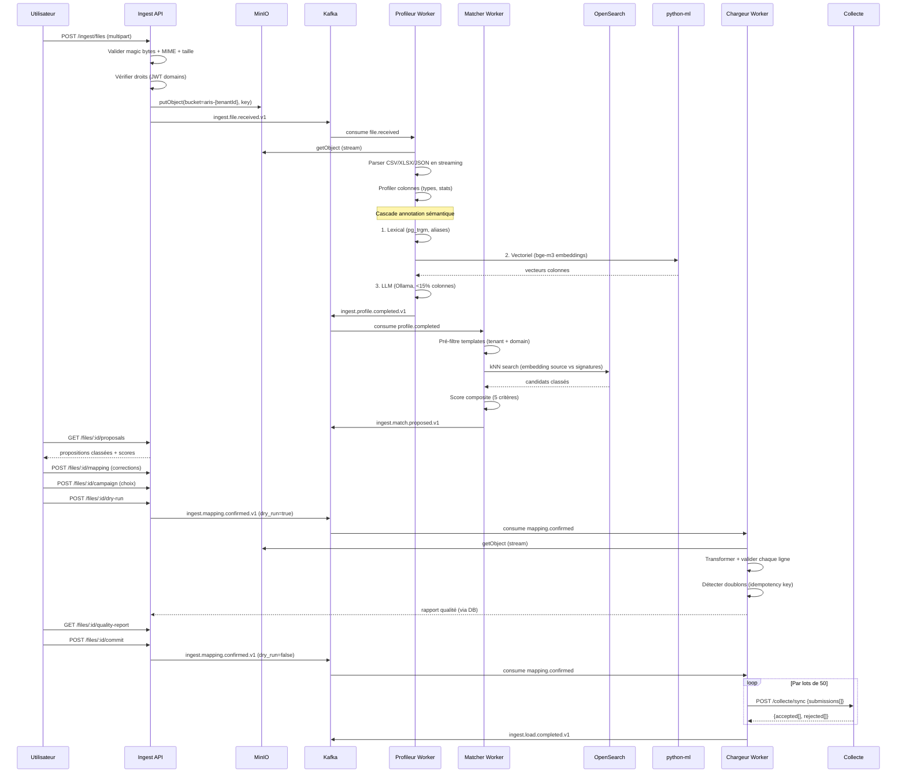

# Service Ingest — Architecture (Lot 0)

**Date :** 2026-09-25
**Port :** 3046
**Schéma PostgreSQL :** `ingest`

---

## 1. Vue d'ensemble

```
                    ┌─────────────┐
                    │  Frontend   │
                    │  Next.js    │
                    └──────┬──────┘
                           │ multipart upload
                    ┌──────▼──────┐
                    │   Ingest    │ port 3046
                    │   Service   │
                    └──┬───┬───┬──┘
                       │   │   │
              ┌────────┘   │   └────────┐
              ▼            ▼            ▼
         ┌────────┐  ┌─────────┐  ┌──────────┐
         │ MinIO  │  │  Kafka  │  │ Postgres │
         │ files  │  │ events  │  │  ingest  │
         └────────┘  └────┬────┘  └──────────┘
                          │
          ┌───────────────┼───────────────┐
          ▼               ▼               ▼
    ┌───────────┐  ┌───────────┐   ┌───────────┐
    │ Profileur │  │  Matcher  │   │  Chargeur │
    │  (worker) │  │  (worker) │   │  (worker) │
    └─────┬─────┘  └─────┬─────┘   └─────┬─────┘
          │              │               │
          │         ┌────▼────┐    ┌─────▼──────┐
          │         │OpenSearch│    │  Collecte  │
          │         │  kNN    │    │ submissions│
          │         └─────────┘    └────────────┘
          │
    ┌─────▼─────┐
    │ python-ml │
    │ embeddings│
    └───────────┘
```

---

## 2. Décisions techniques

### D1 — Schéma PostgreSQL dédié `ingest`

**Choix :** schéma `ingest` séparé.
**Justification :** pattern ARIS (1 schéma/service), isolation des données de staging, pas de collision avec les tables métier.
**Alternative écartée :** schéma `public` (utilisé par Collecte — risque de confusion).

### D2 — Soumission batch via `POST /collecte/sync`

**Choix :** lots de 50 soumissions via l'endpoint sync existant.
**Justification :** 200K lignes × 1 req/ligne = ~1h à 50 req/s. Batch de 50 = ~4000 appels = ~2min. L'endpoint sync retourne `accepted[]`, `rejected[]`, `conflicts[]` — parfait pour le rapport qualité.
**Alternative écartée :** POST unitaire (trop lent), écriture directe (viole R1).

### D3 — Embeddings via `python-ml` sur nbo-ai01

**Choix :** ajouter un endpoint `/api/embeddings` au service `python-ml` existant, avec `sentence-transformers` + bge-m3.
**Justification :** Ollama ne supporte pas bge-m3. python-ml tourne déjà sur nbo-ai01 avec FastAPI. bge-m3 (567M params) est efficace en CPU pour les embeddings (~100ms/batch).
**Alternative écartée :** Ollama embeddings (modèle non disponible), pgvector (extension non installée).

### D4 — Validation fichier par magic bytes

**Choix :** package `file-type` (magic bytes) + validation MIME + limites de taille + protection formules Excel (`=`, `@`, `+`, `-` en début de cellule).
**Justification :** gratuit, sans infra supplémentaire, couvre les menaces principales.
**Alternative écartée :** ClamAV (nécessite un container dédié, maintenance).

### D5 — RLS PostgreSQL sur les tables Ingest

**Choix :** Row-Level Security activé sur toutes les tables du schéma `ingest` avec policy `tenant_id = current_setting('app.tenant_id')`.
**Justification :** filet de sécurité (4e niveau R7). Le service manipule des fichiers bruts multi-tenant — risque de fuite plus élevé.
**Alternative écartée :** reporter (risque acceptable ailleurs, pas ici).

### D6 — Brouillons de formulaire via API FormBuilder

**Choix :** `POST /api/v1/form-builder/templates` avec `status=DRAFT`.
**Justification :** capitalise sur la validation, l'audit, les événements Kafka. Le brouillon est créé au nom de l'utilisateur avec les droits vérifiés par FormBuilder.
**Alternative écartée :** écriture directe dans `form_builder.form_templates` (contourne les validations).

### D7 — Embeddings vectoriels dans OpenSearch (pas pgvector)

**Choix :** index OpenSearch `aris-form-signatures` avec champ `knn_vector` (dimension 1024 pour bge-m3).
**Justification :** pgvector non installé, OpenSearch 2.17 supporte kNN natif. Pas de migration PG nécessaire.
**Alternative écartée :** installer pgvector (risque de régression PG, maintenance supplémentaire).

---

## 3. Modèle de données Prisma

```prisma
// ── Fichier ingest.prisma ──

model IngestFile {
  id                String            @id @default(uuid()) @db.Uuid
  tenantId          String            @map("tenant_id") @db.Uuid
  domainCode        String            @map("domain_code") @db.VarChar(50)
  filename          String            @db.VarChar(500)
  mimeType          String            @map("mime_type") @db.VarChar(100)
  fileSize          BigInt            @map("file_size")
  sha256            String            @db.VarChar(64)
  minioKey          String            @map("minio_key") @db.VarChar(500)
  minioBucket       String            @map("minio_bucket") @db.VarChar(100)
  status            IngestFileStatus  @default(QUARANTINE)
  uploadedBy        String            @map("uploaded_by") @db.Uuid
  errorMessage      String?           @map("error_message") @db.Text
  createdAt         DateTime          @default(now()) @map("created_at") @db.Timestamptz
  updatedAt         DateTime          @updatedAt @map("updated_at") @db.Timestamptz

  profile           SourceProfile?
  matchProposals    MatchProposal[]
  campaignResolution CampaignResolution?
  runs              IngestRun[]

  @@index([tenantId, createdAt], map: "idx_if_tenant_created")
  @@index([status], map: "idx_if_status")
  @@index([sha256], map: "idx_if_sha256")
  @@map("ingest_files")
  @@schema("ingest")
}

enum IngestFileStatus {
  QUARANTINE
  PROFILING
  MATCHED
  MAPPED
  DRY_RUN
  COMMITTED
  FAILED
  CANCELLED
  @@schema("ingest")
}

model SourceProfile {
  id                String          @id @default(uuid()) @db.Uuid
  fileId            String          @unique @map("file_id") @db.Uuid
  sheetCount        Int             @map("sheet_count")
  headerRow         Int             @map("header_row")
  encoding          String          @db.VarChar(30)
  delimiter         String?         @db.VarChar(5)
  rowCount          Int             @map("row_count")
  structureHash     String          @map("structure_hash") @db.VarChar(64)
  createdAt         DateTime        @default(now()) @map("created_at") @db.Timestamptz

  file              IngestFile      @relation(fields: [fileId], references: [id], onDelete: Cascade)
  columns           ColumnProfile[]

  @@index([structureHash], map: "idx_sp_structure_hash")
  @@map("source_profiles")
  @@schema("ingest")
}

model ColumnProfile {
  id                String          @id @default(uuid()) @db.Uuid
  profileId         String          @map("profile_id") @db.Uuid
  sheetIndex        Int             @map("sheet_index") @default(0)
  columnIndex       Int             @map("column_index")
  rawName           String          @map("raw_name") @db.VarChar(500)
  normalizedName    String          @map("normalized_name") @db.VarChar(500)
  inferredType      String          @map("inferred_type") @db.VarChar(30)
  cardinality       Int
  nullRate           Float          @map("null_rate")
  minLength         Int?            @map("min_length")
  maxLength         Int?            @map("max_length")
  sampleValues      Json            @map("sample_values")
  detectedPatterns  Json?           @map("detected_patterns")
  semanticConcept   String?         @map("semantic_concept") @db.VarChar(100)
  confidenceScore   Float?          @map("confidence_score")
  attributionMethod String?         @map("attribution_method") @db.VarChar(10) // LEXICAL, VECTOR, LLM, USER
  createdAt         DateTime        @default(now()) @map("created_at") @db.Timestamptz

  profile           SourceProfile   @relation(fields: [profileId], references: [id], onDelete: Cascade)

  @@index([profileId], map: "idx_cp_profile")
  @@map("column_profiles")
  @@schema("ingest")
}

model FormSignature {
  id                String          @id @default(uuid()) @db.Uuid
  templateId        String          @map("template_id") @db.Uuid
  templateVersion   Int             @map("template_version")
  tenantId          String          @map("tenant_id") @db.Uuid
  domainCode        String          @map("domain_code") @db.VarChar(50)
  fieldCodes        Json            @map("field_codes")       // string[]
  fieldTypes        Json            @map("field_types")       // Record<code, type>
  referentialLinks  Json?           @map("referential_links") // Record<code, masterDataType>
  embeddingVector   Json?           @map("embedding_vector")  // number[] (1024d for bge-m3)
  acceptanceCount   Int             @default(0) @map("acceptance_count")
  computedAt        DateTime        @map("computed_at") @db.Timestamptz
  createdAt         DateTime        @default(now()) @map("created_at") @db.Timestamptz
  updatedAt         DateTime        @updatedAt @map("updated_at") @db.Timestamptz

  @@unique([templateId, templateVersion], map: "uq_fs_template_version")
  @@index([tenantId, domainCode], map: "idx_fs_tenant_domain")
  @@map("form_signatures")
  @@schema("ingest")
}

model MatchProposal {
  id                String          @id @default(uuid()) @db.Uuid
  fileId            String          @map("file_id") @db.Uuid
  templateId        String          @map("template_id") @db.Uuid
  templateName      String          @map("template_name") @db.VarChar(255)
  rank              Int
  scoreGlobal       Float           @map("score_global")
  scoreCoverage     Float           @map("score_coverage")
  scoreSemantic     Float           @map("score_semantic")
  scoreTypes        Float           @map("score_types")
  scoreReferentials Float           @map("score_referentials")
  scoreHistory      Float           @map("score_history")
  status            MatchStatus     @default(PROPOSED)
  createdAt         DateTime        @default(now()) @map("created_at") @db.Timestamptz

  file              IngestFile      @relation(fields: [fileId], references: [id], onDelete: Cascade)
  fieldMappings     FieldMapping[]

  @@index([fileId, rank], map: "idx_mp_file_rank")
  @@map("match_proposals")
  @@schema("ingest")
}

enum MatchStatus {
  PROPOSED
  ACCEPTED
  REJECTED
  @@schema("ingest")
}

model FieldMapping {
  id                String          @id @default(uuid()) @db.Uuid
  proposalId        String          @map("proposal_id") @db.Uuid
  sourceColumn      String          @map("source_column") @db.VarChar(500)
  targetFieldCode   String          @map("target_field_code") @db.VarChar(100)
  targetFieldLabel  String?         @map("target_field_label") @db.VarChar(500)
  transformation    Json?           // { type: "date_format"|"unit_convert"|"ref_lookup"|"constant"|"split"|"unpivot", params }
  origin            String          @db.VarChar(10) // PROPOSED | CORRECTED
  createdAt         DateTime        @default(now()) @map("created_at") @db.Timestamptz

  proposal          MatchProposal   @relation(fields: [proposalId], references: [id], onDelete: Cascade)

  @@map("field_mappings")
  @@schema("ingest")
}

model CampaignResolution {
  id                String          @id @default(uuid()) @db.Uuid
  fileId            String          @unique @map("file_id") @db.Uuid
  campaignId        String?         @map("campaign_id") @db.Uuid
  campaignCode      String?         @map("campaign_code") @db.VarChar(100)
  isNewCampaign     Boolean         @default(false) @map("is_new_campaign")
  derivedParams     Json?           @map("derived_params") // { period, coverage, volume }
  status            String          @default("PENDING") @db.VarChar(20)
  createdAt         DateTime        @default(now()) @map("created_at") @db.Timestamptz

  file              IngestFile      @relation(fields: [fileId], references: [id], onDelete: Cascade)

  @@map("campaign_resolutions")
  @@schema("ingest")
}

model IngestRun {
  id                String          @id @default(uuid()) @db.Uuid
  fileId            String          @map("file_id") @db.Uuid
  type              String          @db.VarChar(10) // DRY_RUN | COMMIT
  totalRows         Int             @map("total_rows")
  acceptedRows      Int             @default(0) @map("accepted_rows")
  rejectedRows      Int             @default(0) @map("rejected_rows")
  warningRows       Int             @default(0) @map("warning_rows")
  duplicateRows     Int             @default(0) @map("duplicate_rows")
  durationMs        Int?            @map("duration_ms")
  status            String          @default("RUNNING") @db.VarChar(20)
  errorMessage      String?         @map("error_message") @db.Text
  createdAt         DateTime        @default(now()) @map("created_at") @db.Timestamptz
  completedAt       DateTime?       @map("completed_at") @db.Timestamptz

  file              IngestFile      @relation(fields: [fileId], references: [id], onDelete: Cascade)
  rowOutcomes       RowOutcome[]

  @@index([fileId], map: "idx_ir_file")
  @@map("ingest_runs")
  @@schema("ingest")
}

model RowOutcome {
  id                String          @id @default(uuid()) @db.Uuid
  runId             String          @map("run_id") @db.Uuid
  rowIndex          Int             @map("row_index")
  idempotencyKey    String          @map("idempotency_key") @db.VarChar(128)
  status            String          @db.VarChar(10) // ACCEPTED, REJECTED, WARNING, DUPLICATE
  reasons           Json?           // [{ code, message, field? }]
  submissionId      String?         @map("submission_id") @db.Uuid
  createdAt         DateTime        @default(now()) @map("created_at") @db.Timestamptz

  run               IngestRun       @relation(fields: [runId], references: [id], onDelete: Cascade)

  @@index([runId, status], map: "idx_ro_run_status")
  @@index([idempotencyKey], map: "idx_ro_idempotency")
  @@map("row_outcomes")
  @@schema("ingest")
}

model MappingCorrection {
  id                String          @id @default(uuid()) @db.Uuid
  tenantId          String          @map("tenant_id") @db.Uuid
  domainCode        String          @map("domain_code") @db.VarChar(50)
  sourceColumnName  String          @map("source_column_name") @db.VarChar(500)
  originalConcept   String?         @map("original_concept") @db.VarChar(100)
  correctedConcept  String          @map("corrected_concept") @db.VarChar(100)
  targetFieldCode   String          @map("target_field_code") @db.VarChar(100)
  templateId        String          @map("template_id") @db.Uuid
  correctedBy       String          @map("corrected_by") @db.Uuid
  createdAt         DateTime        @default(now()) @map("created_at") @db.Timestamptz

  @@index([tenantId, domainCode], map: "idx_mc_tenant_domain")
  @@index([sourceColumnName], map: "idx_mc_source_col")
  @@map("mapping_corrections")
  @@schema("ingest")
}
```

---

## 4. Topics Kafka

| Topic | Producteur | Consommateurs | Payload |
|-------|-----------|---------------|---------|
| `ingest.file.received.v1` | Ingest (API) | Ingest (profileur) | `{ fileId, minioKey, minioBucket, tenantId, domainCode, userId, filename, mimeType, fileSize }` |
| `ingest.profile.completed.v1` | Ingest (profileur) | Ingest (matcher) | `{ fileId, profileId, structureHash, rowCount, columnCount, columns[] }` |
| `ingest.match.proposed.v1` | Ingest (matcher) | Ingest (API) | `{ fileId, proposals[]: { templateId, rank, scoreGlobal, fieldMappings[] } }` |
| `ingest.mapping.confirmed.v1` | Ingest (API) | Ingest (chargeur) | `{ fileId, proposalId, campaignId, fieldMappings[], options }` |
| `ingest.load.completed.v1` | Ingest (chargeur) | Analytics, DataLake | `{ fileId, runId, type, accepted, rejected, warnings, duplicates, durationMs }` |
| `ingest.mapping.corrected.v1` | Ingest (API) | Ingest (apprentissage) | `{ fileId, corrections[] }` |
| `ingest.form.draft.created.v1` | Ingest (générateur) | FormBuilder | `{ fileId, templateId, domainCode, tenantId }` |
| `ingest.dlq.v1` | Ingest (tous) | Monitoring | `{ originalTopic, error, payload }` |

Chaque message porte : `tenantId`, `domainCode`, `correlationId`, `causationId`, `occurredAt`, `schemaVersion`.

---

## 5. Endpoints REST

```
POST   /api/v1/ingest/files                      # Upload multipart (chunked)
GET    /api/v1/ingest/files                       # Liste paginée (tenant-scoped)
GET    /api/v1/ingest/files/:id                   # Détail + statut
GET    /api/v1/ingest/files/:id/profile           # Profil structurel + sémantique
GET    /api/v1/ingest/files/:id/proposals         # Propositions classées
POST   /api/v1/ingest/files/:id/mapping           # Confirmation/correction mapping
POST   /api/v1/ingest/files/:id/campaign          # Choix/création campagne
POST   /api/v1/ingest/files/:id/dry-run           # Simulation
GET    /api/v1/ingest/files/:id/quality-report     # Rapport qualité du dry-run
POST   /api/v1/ingest/files/:id/commit            # Chargement effectif
POST   /api/v1/ingest/files/:id/cancel            # Abandon + purge MinIO
GET    /api/v1/ingest/runs/:id                    # Suivi d'exécution
```

---

## 6. Pipeline asynchrone — diagramme de séquence



---

## 7. Algorithme d'appariement

### Score composite (configurable)

```
score = w1 × couverture_champs_obligatoires    (défaut: 0.35)
      + w2 × similarité_sémantique_moyenne     (défaut: 0.25)
      + w3 × compatibilité_des_types           (défaut: 0.20)
      + w4 × recouvrement_des_référentiels     (défaut: 0.15)
      + w5 × bonus_historique_d_acceptation     (défaut: 0.05)
```

### Seuils (configurables)

| Score | Interprétation |
|-------|----------------|
| ≥ 0.85 | Proposition ferme |
| 0.60 – 0.85 | Proposition à réviser |
| < 0.60 | Aucun formulaire adéquat → parcours création |

### Cascade d'annotation sémantique

| Niveau | Méthode | Seuil de confiance | Outil |
|--------|---------|-------------------|-------|
| 1 | **Lexical** — exact + fuzzy | ≥ 0.90 | `pg_trgm` + dictionnaire d'alias ARIS |
| 2 | **Vectoriel** — cosinus | ≥ 0.80 | OpenSearch kNN + bge-m3 (python-ml) |
| 3 | **LLM** — Qwen 2.5-32B | ≥ 0.70 | Ollama, temp=0, JSON contraint |

Arrêt dès qu'un niveau atteint son seuil. Cible : <15% des colonnes au niveau 3.

---

## 8. Sécurité

| Niveau R7 | Mécanisme | Implémentation |
|-----------|-----------|----------------|
| 1. Réception | Étiquetage JWT | `tenantId` + `domainCode` extraits du token, stockés sur `IngestFile` |
| 2. Appariement | Pré-filtre | `FormSignature` filtré par `tenantId` + `domainCode` AVANT requête kNN |
| 3. Écriture | Vérification Collecte | `POST /collecte/sync` re-vérifie tenant/campagne/droits |
| 4. Base | RLS PostgreSQL | `CREATE POLICY` sur toutes les tables `ingest.*` |

**Fichiers :**
- Magic bytes (`file-type` npm) + MIME validation
- Taille max configurable (`INGEST_MAX_FILE_SIZE`, défaut 100 Mo)
- Protection formules Excel (strip `=`, `@`, `+`, `-` en début de cellule)
- Buckets MinIO : `aris-{tenantId}`, préfixe `ingest/{domainCode}/`
- URLs signées à durée courte (15 min)
- Purge automatique des fichiers en quarantaine après 7 jours (configurable)

---

## 9. Mode dégradé (R6)

| Composant | Indisponible | Comportement |
|-----------|-------------|--------------|
| Ollama (LLM) | Timeout/erreur | Cascade s'arrête au niveau 2 (vectoriel). Si python-ml aussi indisponible, niveau 1 seul (lexical). Flag `degradedMode: true` dans le profil. |
| python-ml (embeddings) | Timeout/erreur | Pas d'embeddings → pas de kNN → appariement lexical seul + compatibilité types. Score réduit. |
| OpenSearch | Indisponible | Fallback PostgreSQL `pg_trgm` pour la similarité. Pas de kNN. |
| Kafka | Indisponible | L'upload REST retourne 503. Pas de traitement asynchrone possible. |
| MinIO | Indisponible | L'upload REST retourne 503. |
| Collecte | Indisponible | Le commit échoue, le dry-run fonctionne (pas d'écriture). |

---

## 10. Plan d'implémentation par lot

### Lot 1 — Réception, profilage, appariement, mapping (~800 lignes backend + ~600 lignes frontend)

| Composant | Fichiers | Estimation |
|-----------|----------|------------|
| Squelette service | `app.ts`, `main.ts`, `plugins/prisma.ts` | 150 lignes |
| Schéma Prisma + RLS | `ingest.prisma`, migration SQL | 200 lignes |
| Upload + quarantaine | `routes/files.ts`, `services/file.service.ts` | 150 lignes |
| Parseurs streaming | `parsers/csv.parser.ts`, `parsers/xlsx.parser.ts`, `parsers/json.parser.ts` | 200 lignes |
| Profileur structurel | `services/profiler.service.ts` | 150 lignes |
| Cascade sémantique | `services/annotator.service.ts` | 200 lignes |
| Signatures formulaires | `services/signature.service.ts` | 100 lignes |
| Moteur d'appariement | `services/matcher.service.ts` | 150 lignes |
| Workers Kafka | `workers/profiler.worker.ts`, `workers/matcher.worker.ts` | 100 lignes |
| Frontend : upload + suivi + profil + mapping | `apps/web/src/app/(dashboard)/ingest/` | 600 lignes |
| Tests unitaires | `*.spec.ts` | 400 lignes |
| Topics Kafka | `shared-types/kafka/topic-names.ts` | 20 lignes |

### Lot 2 — Campagne, dry-run, chargement

| Composant | Estimation |
|-----------|------------|
| Résolution campagne | 150 lignes |
| Moteur de transformation | 200 lignes |
| Dry-run + rapport qualité | 200 lignes |
| Chargeur batch (via Collecte sync) | 200 lignes |
| Détection doublons (idempotency key) | 100 lignes |
| Reprise sur incident | 100 lignes |
| Frontend : rapport + confirmation | 400 lignes |
| Tests | 300 lignes |

### Lot 3 — Génération formulaire + gouvernance

| Composant | Estimation |
|-----------|------------|
| Générateur brouillon | 200 lignes |
| Circuit validation | 150 lignes |
| Détection quasi-doublons | 100 lignes |
| Garde-fous anti-prolifération | 100 lignes |
| Frontend : validation + tableau de bord | 300 lignes |
| Tests | 200 lignes |

### Lot 4 — Apprentissage + anomalies

| Composant | Estimation |
|-----------|------------|
| Collecte corrections | 100 lignes |
| Enrichissement dictionnaire | 100 lignes |
| Reranker XGBoost | 150 lignes (python-ml) |
| Isolation Forest | 100 lignes (python-ml) |
| Métriques qualité | 100 lignes |
| Tests | 150 lignes |

---

## 11. Variables d'environnement

```env
# Service Ingest
INGEST_PORT=3046
INGEST_MAX_FILE_SIZE=104857600        # 100 Mo
INGEST_QUARANTINE_TTL_DAYS=7
INGEST_BATCH_SIZE=50                  # soumissions par lot sync
INGEST_EMBEDDING_DIM=1024             # bge-m3 dimension

# Seuils d'appariement (configurables)
INGEST_SCORE_WEIGHT_COVERAGE=0.35
INGEST_SCORE_WEIGHT_SEMANTIC=0.25
INGEST_SCORE_WEIGHT_TYPES=0.20
INGEST_SCORE_WEIGHT_REFERENTIALS=0.15
INGEST_SCORE_WEIGHT_HISTORY=0.05
INGEST_THRESHOLD_FIRM=0.85
INGEST_THRESHOLD_REVIEW=0.60

# Cascade sémantique
INGEST_LEXICAL_THRESHOLD=0.90
INGEST_VECTOR_THRESHOLD=0.80
INGEST_LLM_THRESHOLD=0.70
INGEST_LLM_MODEL=qwen2.5:32b
INGEST_LLM_FALLBACK_MODEL=qwen2.5:7b
INGEST_LLM_TIMEOUT_MS=600000         # 10 min

# python-ml embeddings
ML_EMBEDDINGS_URL=http://10.202.101.142:8000/api/embeddings
```
